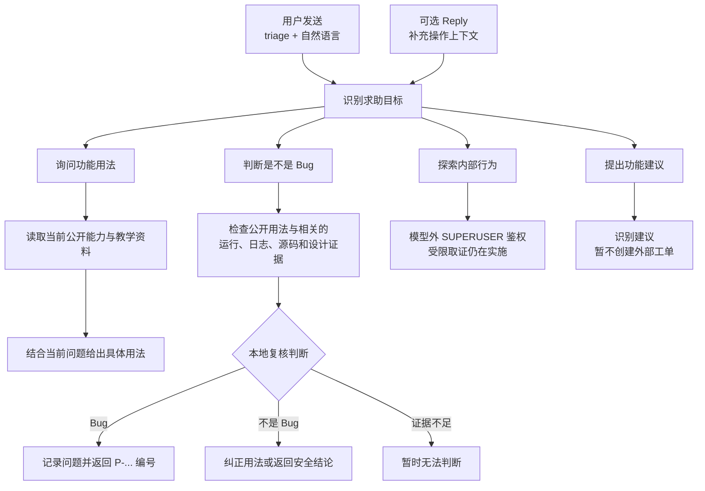
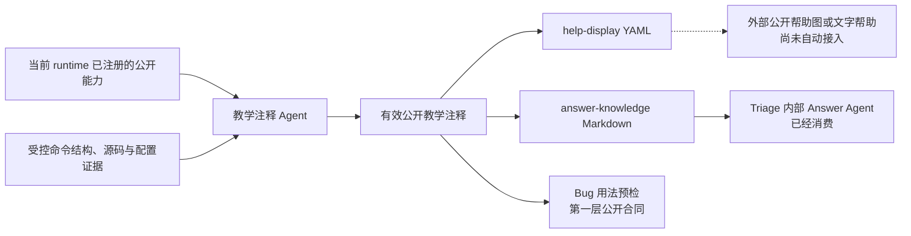

<div align="center">

<a href="https://v2.nonebot.dev/store">
  
</a>

# NoneBot Triage Agent

[](LICENSE)
[](https://www.python.org/)
[](https://nonebot.dev/)
[](https://github.com/Misty02600/nonebot-plugin-triage/actions/workflows/ci.yml)

接收私聊、群聊或频道中的显式求助，并按需关联 NoneBot 本机运行证据。

</div>

## 介绍

发送 `triage <求助内容>` 即可调用插件，`@Bot` 可选。`triage` 后可以直接写自然语言，例如询问功能用法或
描述遇到的问题。回复近期消息时，插件还会尝试关联这条消息在本机产生的运行记录。
只有 Reply、没有 `triage` 的消息不会触发该入口。首轮确实缺少用户可以补充的信息时，插件会在同一
`适配器 + Bot + 会话 + 用户` 作用域保留一次补充机会；下一条显式 `triage` 无需 Reply 即可续接。第二轮
无论是否解决都会关闭，之后的 `triage` 开启新 Thread。同一作用域正在处理时不会排队或并行执行。
Reply 不选择、恢复或延长 Thread；它的可见正文只在路由后帮助识别具体命令、操作或报错，message ID 则
独立用于关联本机运行证据。



详细状态与失败边界见 [triage 自然语言支持流程](docs/architecture/flows/support-intake-routing.md)。

每次非空 `triage` 都经过版本化语义 assessment service。语义模型只接收当前这条规范化请求，输出
`guidance`、`behavior_exploration`、`bug_assessment`、`feature_feedback` 四类目标和独立的现象陈述；
确定性 router 才决定 action，模型不能回答、鉴权或直接建单。当前中文
`support-semantic-v7-prompt-v5-zh` 已通过 40 条独立 forward-heldout：schema、status 与 exact 均为
1.000；运行时只登记该 Prompt、Fixture、隐私、预算与评测 revision 精确组合。router 选择公开能力指导后，插件会从显式 Provider、能力影子与
经校验的教学注释构造只含公开事实的闭合请求，再调用独立的 Answer
Agent 组织自然语言回答。Answer Agent 没有工具，只能把当前问题、公开事实与路由后有界的首轮 / Reply
上下文组织成教学回复；上下文不能覆盖公开事实、权限或披露边界。未明确命中功能时只保留一次补充机会；
正常回答后立即关闭 Thread。失败、超时、未知事实引用或非法输出会退回确定性模板。

当模型识别到用户是在询问“这是不是 Bug”时，会进入独立的只读 Bug assessment。有界 Agent 预加载
当前 Thread 与直接 Reply，并可按需查询 Reply 关联的运行观察与异常 traceback、固定
Bot / 群 / 消息锚点附近的聊天、当前已加载 subject 的 Python 源码、已安装设计知识包和部署摘要，再由
确定性 reconciler 检查引用、revision、freshness 与 partial 状态。聊天中平台可见的正文按原样提供，不做
凭据或个人信息遮蔽；平台原始 envelope 和用户 ID 不进入模型，源码、日志、配置仍执行原有秘密守门。普通用户
只会收到安全的结论，不会看到源码、日志、配置键或内部责任候选。合格 Agent 确认为 Bug 后，插件使用
NoneBot ORM 在一个事务中保存 Report、Occurrence、Problem 和首条 Decision，并返回 `P-...` 问题编号；
重复 Report 幂等，有可复算的同一技术签名时会关联到已有 Problem。`not_bug` 和 `unknown` 不建立问题记录，
也不会自动创建外部 Issue。当前日志证据只覆盖本插件 runtime hook 精确关联捕获的 Matcher / API 异常，
不会搜索任意宿主文件日志。

## 安装

```bash
git clone https://github.com/Misty02600/nonebot-plugin-triage.git
cd nonebot-plugin-triage
uv sync --all-extras --group dev
```

基础安装已经包含 Pydantic AI 公共控制层、只读 Harness 与 Jedi，但不会安装或启用任何模型 Provider SDK。
使用当前 OpenCode Go transport（供教学注释和受控模型任务）时还需安装
`nonebot-plugin-triage[openai]`；Anthropic 部署使用 `[anthropic]`。OpenCode Go 复用 Pydantic AI 的
OpenAI Provider，不再声明内容重复的专用 extra。

NoneBot Adapter 由宿主 Bot 按实际平台自行安装并注册。Triage 不提供 `onebot` / `discord` extras，也不会
替宿主注册 Adapter；没有安装 OneBot 时，只会缺少 OneBot 群历史与出站引用等平台增强，通用插件入口和
能力索引仍可加载。

在宿主 NoneBot 项目中加载插件：

```toml
[tool.nonebot]
plugins = ["nonebot_plugin_triage"]
```

首次安装或更新到包含数据库 schema 变更的版本后，在宿主 NoneBot 项目执行：

```bash
uv run nb orm upgrade
```

问题库默认使用 NoneBot ORM 与 LocalStore 管理的 SQLite，Triage 不再增加数据库路径配置。

## 配置

`triage` 命令根、`triage 报错查询` 维护子命令、Matcher 优先级和 2000 字入口上限是当前版本固定的产品合同，
不再通过环境变量改写。以下各项的“含义”直接说明其控制对象、默认行为、作用域与失败边界。

| 配置项 | 默认值 | 含义 |
|---|---:|---|
| `NBTRIAGE_COOLDOWN_SECONDS` | `2` | 同一适配器、Bot、会话和用户每次进入 `triage` 后，在该秒数内再次发送任何 `triage` 请求都会被拒绝；首轮、续问、空输入、超长输入、教学、澄清和报障共用窗口。窗口只在当前进程内存中，重启清空，不是跨进程配额或模型费用预算。 |
| `NBTRIAGE_RATE_LIMIT_MAX_SCOPES` | `4096` | 当前进程入口限流表最多保留的不同 `适配器 + Bot + 会话 + 用户` scope 数；容量满时淘汰最旧 scope 并累计 drop 计数。它限制内存键数量，不提高单个用户频率，也不提供跨进程协调。 |
| `NBTRIAGE_CAPABILITY_VISIBILITY_TIMEOUT_SECONDS` | `0.25` | 收集显式 Alconna 能力时，等待单个第三方 Provider 异步可见性判断的最长秒数；超时、异常或返回 false 的能力不会进入本轮公开说明。它不控制模型请求或能力影子后台刷新。 |
| `NBTRIAGE_OBSERVATION_MAX_ENTRIES` | `10000` | 当前进程最多保留的 NoneBot 生命周期观察记录数，用于 Reply 关联后的可信失败复核；容量满时旧记录被淘汰，原始 API data/result 不会存入该 buffer，重启后清空。 |
| `NBTRIAGE_OBSERVATION_RETENTION_SECONDS` | `900` | 生命周期观察记录可参与故障证据关联的最长秒数；过期记录不能再支持 Incident，同时也界定受理服务接受证据的时间范围。它不是日志保存期。 |
| `NBTRIAGE_REFERENCE_MAX_ENTRIES` | `4096` | 当前进程最多保留的出站消息引用索引数，用于把用户 Reply 的 `message_id` 精确关联到近期 Bot 运行；容量满时旧引用被淘汰，索引保存 HMAC scope 而不是平台身份原文。 |
| `NBTRIAGE_REFERENCE_RETENTION_SECONDS` | `900` | 出站引用可以被 Reply 命中的最长秒数；过期 Reply 不能再关联本机运行证据。该索引不选择 Thread，也不控制补充机会。 |
| `NBTRIAGE_THREAD_IDLE_SECONDS` | `900` | 未解决首轮等待唯一一次显式 `triage` 补充的最长空闲秒数；成功消费补充、得到终局结果或处理失败都会关闭。 |
| `NBTRIAGE_THREAD_ABSOLUTE_SECONDS` | `1800` | Thread 从首轮创建起不可延长的总寿命；到期后的下一条 `triage` 开启新 Thread。该值不能短于空闲期限。 |
| `NBTRIAGE_THREAD_MAX_ENTRIES` | `4096` | 当前进程最多保存的短期 Thread 数量；容量满时旧状态会被淘汰，重启后全部清空，不是持久会话存储。 |
| `NBTRIAGE_INCIDENT_MAX_ENTRIES` | `256` | 当前进程最多保存的短期 Incident/活跃 trial 数量；容量满时旧项被淘汰，查询可能返回未找到。它不是数据库容量或持久工单上限。 |
| `NBTRIAGE_INCIDENT_RETENTION_SECONDS` | `86400` | Incident 与活跃 trial 在当前进程中可查询、反馈和汇总的最长秒数；过期或重启后维护命令不再命中。已写入 observe JSONL 的最小审计事件不由该值删除。 |
| `NBTRIAGE_TRIAL_MODE` | `off` | `off` 不创建 trial sink、不解析 LocalStore data 路径，也不写观察型事件；`observe` 把受理、查询、反馈和统计所需的最小审计事件写入 LocalStore data。它不启用模型，也不放宽 Incident 证据门。 |
| `NBTRIAGE_TRIAL_LOG_MAX_BYTES` | `10485760` | `observe` 模式下单个 `trial-events.jsonl` 文件轮转前允许的最大字节数；达到上限后按备份数量轮转。`off` 时不使用该值。 |
| `NBTRIAGE_TRIAL_LOG_BACKUP_COUNT` | `5` | `observe` 模式下轮转 JSONL 最多保留的历史备份数；超出的最旧备份被轮转策略删除。它不改变内存 Incident 的数量或寿命。 |
| `NBTRIAGE_KNOWLEDGE_PACK_AUTO_UPDATE` | `true` | 启动后后台检查项目维护的 stable catalog；先恢复本地 active 包，新包完整校验后才原子切换。断网、catalog / 下载 / 校验失败均继续使用旧包或降级为 no-knowledge，不阻止插件加载。设为 `false` 可关闭默认联网检查。 |
| `NBTRIAGE_KNOWLEDGE_PACK_URL` | 未设置 | 与 SHA-256 成对固定经过发布审核的 HTTPS knowledge pack 资产，并覆盖 stable catalog；适合离线镜像或可复现实验。固定包安装仍在后台执行；URL / SHA 只配一项或格式非法时只禁用知识服务，不阻止 Bot 启动，也不会偷偷改用 stable catalog。 |
| `NBTRIAGE_KNOWLEDGE_PACK_SHA256` | 未设置 | 与 URL 成对固定 knowledge pack 压缩包的 64 位十六进制 SHA-256；下载内容不匹配时拒绝安装。它校验制品身份，不表示制品来源或许可证已自动获准。 |
| `NBTRIAGE_MODEL_BACKEND` | 未设置 | 与 `NBTRIAGE_MODEL_NAME` 成对选择模型 transport；可用内置别名，或设为 `pydantic-ai` 并使用 Pydantic AI 的 `provider:model` 标识。未设置时插件仍能启动并提供确定性能力索引，但不会生成教学注释、执行语义分类或调用 Answer Agent。Provider SDK、密钥或传输能力不可用时，对应模型增强会降级而不阻断插件加载。 |
| `NBTRIAGE_MODEL_NAME` | 未设置 | 与 backend 成对选择精确模型。未设置时沿用无模型降级；与 backend 只设置一项仍属于配置错误。held-out 只标记项目已经验证的精确组合，未评测模型不会因此被拒绝运行。 |
| `NBTRIAGE_MODEL_TIMEOUT_SECONDS` | `60` | 单次语义、公开能力回答或自动教学注释请求的最长等待时间；这三类请求都不做 Provider 自动重试。Bug Agent 使用独立的 120 秒任务上限。与已发布评测预算不同只会使组合显示为未验证，不会成为运行禁令。 |
| `NBTRIAGE_MODEL_MAX_OUTPUT_TOKENS` | `240` | 单次语义 assessment 与 Answer Agent 结构化输出的 token 上限。自动教学注释使用任务内固定的 16384 output token；Bug Agent 使用独立的 800 output token、最多 8 次请求、6 次实际证据读取和 0.50 美元单轮预算。它不限制用户输入长度；与已发布评测预算不同会使用新的未验证质量标签。 |
| `NBTRIAGE_AGENT_TRACE_ENABLED` | `true` | 模型 transport 已配置时，把脱敏后的 Pydantic AI Agent / model / tool spans 写入本插件 LocalStore data 下的 `agent-traces.jsonl`；固定按 10 MiB、5 个备份轮转。文件只含调用结构、耗时、状态、Provider/model、token、费用、安全关联 ID，以及响应 part 类型和正文/工具参数长度等无内容形状，不含 Prompt、源码、模型原文、工具参数/结果或配置值。设为 `false` 时不解析路径、不创建文件。 |
| `NBTRIAGE_CAPABILITY_ANNOTATION_MAX_CONCURRENCY` | `4` | 自动教学注释同时分析的插件数上限，范围 `1..32`。不同插件有限并发，同一插件内分析单元保持顺序；设为 `1` 可恢复全局串行。它不改变单次请求 timeout，较慢 Provider 继续通过 `NBTRIAGE_MODEL_TIMEOUT_SECONDS` 调整。 |
| `NBTRIAGE_RESTRICTED_CONFIG` | `[]` | JSON 数组，列出禁止把实际值交给能力分析模型的 NoneBot 顶层配置键；键名大小写不敏感，`FOO__BAR` 等嵌套写法按顶层 `foo` 整项限制。命中后在读取实际值前拒绝；它不会删除 NoneBot 配置、禁止分析公开 schema/源码，也不表示未列出的整份 `.env` 会被发送。 |
| `NBTRIAGE_EVIDENCE_DENIED_PATTERNS` | `[]` | JSON 数组，为所有只读源码与文件证据根追加相对 POSIX glob 拒绝项；例如 `"private/**"`。它只能在内置硬拒绝之外继续缩小范围，不能重新允许 `.env`、凭据、越界路径或 symlink 外跳。教学和 Bug 仍分别应用自己的任务级拒绝与日志准入规则。 |

OpenCode Go 配置示例：

```dotenv
NBTRIAGE_MODEL_BACKEND=opencode-go-chat
NBTRIAGE_MODEL_NAME=deepseek-v4-flash
NBTRIAGE_MODEL_TIMEOUT_SECONDS=60
NBTRIAGE_MODEL_MAX_OUTPUT_TOKENS=240
```

其他 Pydantic AI Provider 可使用通用模型标识，例如：

```dotenv
NBTRIAGE_MODEL_BACKEND=pydantic-ai
NBTRIAGE_MODEL_NAME=google-gla:gemini-2.5-flash
```

中国大陆百炼使用项目固定的国内端点标识，不开放任意 Base URL：

```dotenv
DASHSCOPE_API_KEY=<百炼 API Key>
NBTRIAGE_MODEL_BACKEND=pydantic-ai
NBTRIAGE_MODEL_NAME=alibaba-cn:qwen-max
```

Pydantic AI 原生的 `alibaba:<模型>` 仍表示国际站 DashScope；`alibaba-cn:<模型>` 固定使用中国大陆
OpenAI-compatible endpoint。两者都需要安装 `openai` Provider 依赖。Coding Plan / Token Plan 专属 Key
不适用于 Bot 后端或自动批量生成。

部署者还需安装该 Provider 的 Pydantic AI SDK 依赖并配置其标准密钥环境变量。项目支持矩阵中的 held-out
结果用于说明已验证质量，不是运行白名单；未评测组合仍执行相同 schema、Evidence、安全和预算检查。

密钥只从对应 Provider 的标准进程环境变量读取，不写入 `NBTriageConfig`；例如 OpenCode Go 使用
`OPENCODE_API_KEY`，中国大陆百炼使用 `DASHSCOPE_API_KEY` 或 `ALIBABA_API_KEY`。语义 assessment 只发送当前单条、
规范化并通过秘密守门的 `triage` 请求文字，不接收 Reply 或 Thread。公开能力 Answer Agent 在路由后另接收
同一问题、本轮已经过滤为 public 的能力事实，以及有界的首轮 / 直接 Reply 可见正文；上下文不能成为能力
事实或权限。两类请求都不接收配置、环境变量、日志、源码、运行证据、证据位置或 restricted 能力，并各自
最多一次请求、零自动重试、不切换模型。
语义失败会 abstain；回答失败或非法引用会退回确定性模板。语义客户端使用 Pydantic AI
`Agent(output_type=SupportSemanticAssessment)`；当前
OpenCode Go Profile 以 `final_result` output tool 承载闭合结果，该 tool 只用于结构化返回，插件不会把它
升级为业务工具或副作用授权。

Bug assessment 使用独立的数据与任务合同。它可以把与本案相关、已经绑定 subject / revision / correlation
并清理秘密的源码、关联异常日志、完整 traceback 与获准设计摘录发送给 Bug Agent；直接 Reply 与模型外
固定锚点读取的同群可见聊天正文则原样提供，不执行凭据或个人信息遮蔽。它不会上传整个仓库、任意文件日志、
平台原始 event、原始用户 ID 或配置。Agent 直接使用 Pydantic AI 原生
`Agent(output_type=BugAssessmentCandidate)`、`Tool`、`ModelProfile` 和 `UsageLimits`，模型候选不能绕过
本地 reconciliation，也不能写 LocalStore、建 incident、发送额外消息或执行插件代码。
Bug 的源码工具只在当前已加载 subject 的批准插件根内执行有界 Python 文本搜索和按文件读取；它不会启动
外部语言服务器、读取整个仓库或越过路径、文件大小与结果数量门禁。共享的 Direct Jedi
`go_to_definition` 与只读 FileSystem 目前服务教学注释，尚未接入 Bug。

Answer Agent v2 使用 `Agent(output_type=PublicGuidanceAnswer)`，输出最多 1000 字回答及实际使用的公开事实
ID；它不执行命令，也不能把模型文本升级为工具或授权。该回答任务已经完成闭合 schema、假 HTTP、Handler
回归和两条真实 Provider smoke：Reply 指代能定位“搜图”用法，恶意 Reply 文字不能覆盖公开权限事实。它尚未
完成独立真实模型 held-out 回答质量 Gate，因此没有项目验证质量标签；这不阻止部署者实际使用。

当前语义字段的中文对应为：`guidance`（公开能力指导）、`behavior_exploration`（行为探索）、
`bug_assessment`（Bug 判定）、`feature_feedback`（功能建议）；另有
`reported_observation`（用户陈述当前或过去真实发生过 Bot 行为）。公开能力、语法、参数、公开角色、场景和
前提由 guidance 回答；需要源码、内部配置、环境、版本、调用流或运行证据的内部原因进入 behavior
exploration。分类不接收身份，选中行为探索后才执行模型外 `SUPERUSER` 鉴权。
Bug 判定同样不依赖身份，但它只回答三值结论；如果用户明确要求查看源码、配置、环境、版本、调用流或运行
证据本身，才属于 behavior exploration，并在分类后执行 `SUPERUSER` 鉴权。一次请求可以识别多个目标，
router 仍只执行一个动作。

`observe` 模式的审计事件固定写入 LocalStore 为本插件解析出的 data 目录下
`trial-events.jsonl`；部署者如需更换目录，使用 LocalStore 的 `LOCALSTORE_PLUGIN_DATA_DIR`，插件不再提供
独立日志路径配置。旧 `NBTRIAGE_TRIAL_LOG_PATH` 会在初始化时给出迁移错误；既有
`logs/nbtriage-trials.jsonl` 不会自动迁移、合并或读取。

配置模型 transport 后，脱敏 Agent 轨迹默认写入同一插件 data 目录下的 `agent-traces.jsonl`。它和普通告警
日志互补：日志快速指出失败单元，trace 用共同的 trace ID 串起 Agent run、模型请求、工具调用、重试、耗时和
token。教学注释还会写入独立的无内容 response-shape span，记录最终响应的 part 类型、文本/思考/工具参数
字符数，以及能够完整解析时的 entry、claim、constraint 数量和各 entry 的 Answer Markdown 字符数。轨迹
不会保存生成所用的源码、Prompt、模型原文、工具正文或配置值，也不会自动上传；可通过
`NBTRIAGE_AGENT_TRACE_ENABLED=false` 完全关闭。部署者可以先用 `nb localstore data` 查看 LocalStore data
基目录；插件启动日志也会打印本次解析出的 `agent-traces.jsonl` 完整路径。

`NBTRIAGE_RESTRICTED_CONFIG` 的 JSON 数组格式示例：

```dotenv
NBTRIAGE_RESTRICTED_CONFIG='["DISCORD_BOTS", "PLUGIN_COOKIE"]'
```

### 指令教学数据

指令教学注释在后台按能力 revision 生成并复用缓存，不会在每次用户提问时重新分析源码。一次有效分析会
投影为面向公开展示和内部回答的两类数据：



配置了可用的模型 transport 后，后台教学注释任务会按插件有限并发地分析本轮
所有符合准入条件但没有有效缓存的当前能力；同一插件内的分析单元仍保持顺序。每个单元从当前 runtime
snapshot 出发，先提供确定性的命令结构、ast-grep Matcher 结构、已加载 handler 片段和当前内存配置投影；
初始 Evidence 不足时，Agent 才能在批准的 Bot、插件与 LocalStore 根中使用只读 glob/search/read，或用 Jedi
从已读 Python 标识符转到当前解释器依赖的定义。依赖根不允许自由 glob，只允许按已知位置读取；`.env*`、
凭据、数据库、教学日志、人工维护的帮助 YAML、评测 Gold 和本任务生成的 help-display 始终不能进入教学模型。
Bot 项目根只用于非 Python 项目文本和配置，Python 源码必须从本轮已加载目标插件的独立源码根读取，不能
借项目根遍历其他本地插件。
配置当前值只从已构造且与源码引用匹配的 Pydantic 实例投影，并在读取前应用
`NBTRIAGE_RESTRICTED_CONFIG`，不会读取整份 Config、消息、用户身份或枚举进程环境。

模型输出必须引用本轮初始 Evidence 或成功 `read_file` 返回的动态 Evidence。LocalStore cache 不保存源码正文
或配置值，只保存公开教学文本、请求指纹，以及用于复核动态证据是否仍有效的 Evidence ID、相对位置和文件
revision。旧 cache 只有在能力仍于当前 runtime 成功注册、插件源码与其他生成输入未变、动态证据 revision
仍匹配时才能提供，因此
插件加载失败或本轮未观察到的能力不会成为普通用户可见的“幽灵帮助”。未评测模型也可以生成，但仍须通过
相同的模型外闭合检查，并以未验证质量标签记录。当前 schema 6 允许一次分析产生多个模型外固定 ID 的公开 entry：确定性的 Alconna
子命令分别成为帮助条目，Option、别名和同功能用法仍留在同一 entry；模型直接返回完整命令正文，不再使用
`{command}`，也不再输出结构化 interaction。2026-08-16 的全新 v3 24 条真实 Provider held-out 中，schema、
Evidence 闭合、投影、预算、工具与 12/12 源码提取均通过，但安全率 0.9167、语义率 0.3333，质量 Gate 仍失败，
因此不能继承 semantic、Bug 或 Answer 任务的质量结论，也不宣称该精确组合具有同等已验证质量。

完整刷新会从同一份有效教学注释生成两类一插件一文件的数据：面向外部公开帮助消费者的紧凑 YAML 和供 Answer
补充公开细节的 Markdown。它们写入 Triage 自己的 LocalStore plugin data：
`capability-teaching/objects/<generation>/help-display/<module_name>.yml` 与
`capability-teaching/objects/<generation>/answer-knowledge/<module_name>.md`。两类文件和 manifest 全部写完后才
原子替换 `capability-teaching/current.json`，所以不会出现一半新、一半旧。文件不包含源码、Evidence、配置
值、指纹或审核状态。当前版本不设草稿或审核流程，也没有把 YAML 目录接入外部帮助系统；这些文件目前用于
部署者观察效果，并由 Triage 的 Answer 公开教学视图消费。

带闭包 Handler 的参数化 Matcher 不再逐条重复调用模型：Triage 只在能用精确源码位置找到唯一外层工厂、
且该工厂所有 Runtime 成员都通过公开准入时，把工厂作为一个分析单元。模型阅读工厂源码和批准 Evidence，
能形成可靠共同说明才启用知识；否则缓存 `knowledge_enabled=false`，两种公开文件都不生成该条目。首版仍
排除全局消息、通知、请求和其他没有确定公开触发形式的被动监听器。

## 使用

普通用户入口可以在私聊、群聊或频道直接发送，也可以 `@Bot` 后发送；三种会话使用相同分流和调用者
鉴权规则。私聊目前不能建立故障记录，维护命令仍需要 `@Bot`。配置的 Provider/model 可由 Pydantic AI
解析、所需 SDK 和密钥可用且传输能力满足当前任务时，下表的 `triage` 场景会调用在线语义分类。当前
semantic v7 中文 Prompt 的 OpenCode Go 精确组合已有公开 held-out 结果；其他组合可以运行，但标记为未验证。

| 指令                                              | 权限      | 说明                           |
| ------------------------------------------------- | --------- | ------------------------------ |
| `triage 某个功能怎么使用`                         | 所有人    | 说明当前平台确定公开的功能     |
| 同一会话继续发送 `triage <补充>`                  | 所有人    | 首轮未解决时消费唯一一次补充机会；Reply 可选 |
| `triage <公开能力问题>`                            | 所有人    | 检索当前平台可安全说明的能力   |
| `triage 刷新帮助 [plugin_module]`                 | SUPERUSER | 强制刷新全部或指定插件模块的教学数据 |
| `triage 这是不是 Bug`                             | 所有人    | 判断 Bug / 非 Bug / 未知；确认 Bug 时自动记录 |
| `triage <内部行为探索问题>`                        | SUPERUSER | 鉴权后进入行为探索候选；完整取证仍在实施 |
| `triage 报错查询`                                 | SUPERUSER | 列出当前所有待处理 Problem |
| `triage 报错查询 <P-编号>`                        | SUPERUSER | 查看判断、报告/发生次数和状态 |
| `triage 报错查询 <P-编号> <确认Bug/确认非Bug/解决>` | SUPERUSER | 追加人工 Decision 或标记已解决 |

跨平台命令、结构化 Reply / Target 与回复发送由 Alconna / UniSeg 提供；Thread 由插件自己的 HMAC scope
索引校验 `adapter + Bot + conversation + actor`、有效期和单活动 lease。等待补充只要求当前回答发送成功，
不再要求 Receipt 返回 message ID。OneBot 的全局出站 Provider 继续只负责运行证据 correlation；Reply 正文
可进入路由后的 Guidance / Bug 上下文，但不能改变 Thread 归属或权限。

### 本地能力影子索引

能力影子默认启用，并使用 LocalStore 管理的插件 cache；部署者不需要也不能通过 Triage 配置指定 SQLite
路径。它是可删除重建的派生索引，不是用户数据或权威状态；文件位置、文件名和数据库格式不属于公开合同。

启动钩子只调度后台刷新，不等待制品扫描或索引构建；实际工作通过线程执行，不阻塞 Bot 启动关键路径。
后台任务读取标准 `pyproject.toml` 的 NoneBot 声明、安装制品 revision 和实际已加载模块做
`registered / not_observed / runtime_only` 协调，再从已加载的 Plugin、Matcher、Alconna 结构、插件元数据
和轻量本地源码摘要原子生成全文索引。同一轮 deployment 构建只枚举一次 distribution package map。每个
命令或 Matcher 保持独立记录；基础索引不分析 handler 效果、推断跨 Matcher 角色，也不做逐文件模块源码对齐。它不调用
第三方 Rule、Permission、handler 或命令解析，也不读取
`.env`、日志和运行数据。每条记录分别保存 `public / restricted` 受众、`all / explicit / unknown`
平台范围、具体 `analysis_issues`、执行约束和记录状态。确定命令入口、当前 adapter 在范围内、没有分析问题、
记录状态不是 `conflicted / stale`、快照明确完整且索引新鲜时才进入普通用户检索。启用自动教学注释时，
源码分析只补充满足这些运行时条件的现有记录，不会把静态扫描结果升级成“当前可用”事实。动态、被动、冲突或证据
不足的能力会保留对应 issue，不要求部署者逐命令审核。代表部署开发 / 维护者的 `SUPERUSER`、
`CommandMeta.hide=True`
或停用能力会以 `restricted` 写入本地索引，但普通检索不会返回。只有先在模型外确认
当前调用者有权查看的路径，才能检索这部分能力。Token、配置原文和私密日志不是能力，始终从采集源排除；
部署者以后也可以通过独立的 operator exclude policy 在持久化前完全排除某些能力。

源码仓库中的维护命令可以检索该索引：

```bash
just maintainer search-capabilities "搜图怎么用" \
  --index data/nbtriage-capabilities.sqlite3 \
  --include-unresolved
```

本地维护者已经在模型外确认自己有权查看当前部署的内部能力时，可以额外使用 `--include-restricted`。CLI
开关只是声明带外授权，不自行检查身份；语义 router 选中行为探索后，私聊、群聊和频道中的 `triage` 都会
对当前 Bot / Event 的请求者执行同一 NoneBot `SUPERUSER` 检查。behavior candidate 的鉴权已接入，但取证
和解释编排仍未实现，因此当前只返回有界状态，不读取 restricted 索引；semantic v7 可以识别并鉴权该目标，
但不能把鉴权成功写成已经完成源码解释。

这条检索链不依赖模型、网络或向量服务。首次后台构建尚未发布可服务 generation 时，普通用户继续回退
显式 Provider；发布后也只检索派生 ServingView 中符合上述条件的能力。
维护者 CLI 还可以显式查看带具体 `analysis_issues` 的未解决能力和 `restricted` 能力；维护者结果报告实际 issue，
不把它们笼统称为待审核候选。索引缺少可靠用法或存在
不透明规则时不会补写参数，也不会把“发现到”宣称为“当前一定能执行”。启动刷新失败但仍有上一份成功构建
索引时，维护者回复会明确标记快照陈旧；第三方说明中的 mention 和 Unicode 控制字符会在发送前中和。

## 许可证

本项目使用 [MIT License](LICENSE)。
