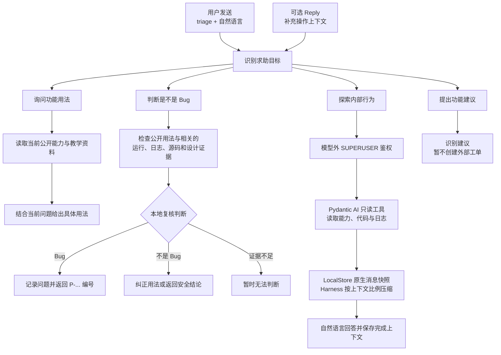

<div align="center">

<a href="https://v2.nonebot.dev/store">
  
</a>

# ✨ nonebot-plugin-triage ✨

_✨ 发送 `triage` 即可分流求助、判断 Bug、讲解能力的 NoneBot 插件 ✨_

<p align="center">
  
  
  
  
  
  <a href="https://github.com/Misty02600/nonebot-plugin-triage/actions/workflows/ci.yml">
    
  </a>
</p>

</div>

## 📖 介绍

在私聊、群聊或频道发送 `triage <求助内容>`（`@Bot` 可选）即可调用，后面可以跟任意自然语言。插件会结合
本机运行证据，按意图分流：

- **问功能用法** → 结合当前部署的公开能力与后台生成的教学资料，给出具体回答；
- **判断 Bug** → 用有限的只读证据（运行观察、关联日志、源码、设计知识包）调查，返回
  `Bug / 不是 Bug / 无法判断`；确认是 Bug 才在本地问题库记录并返回 `P-...` 编号；
- **行为探索 / 维护者对话** → 私聊中的 SUPERUSER 直接用 `triage` 进入部署内唯一的全局只读会话，查看代码、
  日志和配置投影；群聊、频道和私聊非超管不进入，报告了真实现象的内容转入 Bug 判定；
- **功能建议** → 只识别，暂不建立外部工单。

模型只负责受限的语义判断和回答候选：路由、鉴权、状态和副作用一律由插件本地决定。模型不能直接建单、
发消息或执行代码，也默认看不到 `.env`、凭据、密钥、数据库和未公开能力。




## 💿 安装

<details open>
<summary>使用 nb-cli 安装</summary>
在 nonebot2 项目的根目录下打开命令行, 输入以下指令即可安装

    nb plugin install nonebot-plugin-triage --upgrade
使用 **pypi** 源安装

    nb plugin install nonebot-plugin-triage --upgrade -i "https://pypi.org/simple"
使用**清华源**安装

    nb plugin install nonebot-plugin-triage --upgrade -i "https://pypi.tuna.tsinghua.edu.cn/simple"


</details>

<details>
<summary>使用包管理器安装</summary>
在 nonebot2 项目的插件目录下, 打开命令行, 根据你使用的包管理器, 输入相应的安装命令

<details open>
<summary>uv</summary>

    uv add nonebot-plugin-triage
安装仓库 main 分支

    uv add git+https://github.com/Misty02600/nonebot-plugin-triage@main
</details>

<details>
<summary>pdm</summary>

    pdm add nonebot-plugin-triage
安装仓库 main 分支

    pdm add git+https://github.com/Misty02600/nonebot-plugin-triage@main
</details>
<details>
<summary>poetry</summary>

    poetry add nonebot-plugin-triage
安装仓库 main 分支

    poetry add git+https://github.com/Misty02600/nonebot-plugin-triage@main
</details>

打开 nonebot2 项目根目录下的 `pyproject.toml` 文件, 在 `[tool.nonebot]` 部分追加写入

    plugins = ["nonebot_plugin_triage"]

</details>

<details>
<summary>使用 nbr 安装(使用 uv 管理依赖可用)</summary>

[nbr](https://github.com/fllesser/nbr) 是一个基于 uv 的 nb-cli，可以方便地管理 nonebot2

    nbr plugin install nonebot-plugin-triage
使用 **pypi** 源安装

    nbr plugin install nonebot-plugin-triage -i "https://pypi.org/simple"
使用**清华源**安装

    nbr plugin install nonebot-plugin-triage -i "https://pypi.tuna.tsinghua.edu.cn/simple"

</details>

模型 Provider SDK 是可选 extras：OpenAI / DeepSeek / 百炼等 OpenAI SDK 系 Provider 安装
`nonebot-plugin-triage[openai]`，Anthropic 部署使用 `[anthropic]`；NoneBot Adapter 由宿主 Bot 按平台
自行安装。首次安装或更新到包含 schema 变更的版本后，在宿主 NoneBot 项目执行 `uv run nb orm upgrade`。

## ⚙️ 配置

所有配置项都可选，唯一需要正确填写的是模型 transport。未配置模型时插件仍能启动并提供确定性的能力索引，
但不会生成教学注释、执行语义分类或调用对话 Agent。

极简配置示例：

```dotenv
NBTRIAGE_MODEL_NAME=google:gemini-2.5-flash
```

常用配置（完整列表与详细含义见 [配置参考](docs/operations/configuration.md)）：

| 配置项                                |               必填 | 默认值 | 说明                                                                                        |
| ------------------------------------- | -----------------: | -----: | ------------------------------------------------------------------------------------------- |
| `NBTRIAGE_MODEL_NAME`                 | 使用模型功能时必填 | 未设置 | `provider:model`，如 `google:gemini-2.5-flash`、`alibaba:qwen-max`；唯一 transport 选择字段 |
| `NBTRIAGE_MODEL_BASE_URL`             |                 否 | 未设置 | 覆盖 Provider 部署地址；外部必须 HTTPS，不得带凭据 / query / fragment                       |
| `NBTRIAGE_MODEL_TIMEOUT_SECONDS`      |                 否 |   `60` | 单次模型请求的最长等待秒数（`0 < 值 ≤ 400`）                                                |
| `NBTRIAGE_AGENT_TRACE_ENABLED`        |                 否 | `true` | 把脱敏后的 Agent / 模型 / 工具 span 写入 `agent-traces.jsonl`（10 MiB、5 备份轮转）         |
| `NBTRIAGE_KNOWLEDGE_PACK_AUTO_UPDATE` |                 否 | `true` | 启动后后台检查并安装冻结的 NoneBot 知识包；断网或校验失败不影响 Bot 启动                    |
| `NBTRIAGE_COOLDOWN_SECONDS`           |                 否 |    `2` | 同一 `适配器 + Bot + 会话 + 用户` 两次 `triage` 的最短间隔                                  |

不同服务的填写方式：

| 服务                        | `NBTRIAGE_MODEL_NAME`   | `NBTRIAGE_MODEL_BASE_URL`                           | 密钥环境变量                             |
| --------------------------- | ----------------------- | --------------------------------------------------- | ---------------------------------------- |
| DeepSeek                    | `deepseek:<模型 ID>`    | 不设置                                              | `DEEPSEEK_API_KEY`                       |
| 中国大陆百炼                | `alibaba:<模型 ID>`     | `https://dashscope.aliyuncs.com/compatible-mode/v1` | `DASHSCOPE_API_KEY` 或 `ALIBABA_API_KEY` |
| 国际站 DashScope            | `alibaba:<模型 ID>`     | 不设置                                              | `DASHSCOPE_API_KEY` 或 `ALIBABA_API_KEY` |
| Google Gemini API           | `google:<模型 ID>`      | 不设置                                              | `GOOGLE_API_KEY` 或 `GEMINI_API_KEY`     |
| 其他 OpenAI-compatible 服务 | `openai-chat:<模型 ID>` | 服务商提供的 HTTPS API 根地址                       | `OPENAI_API_KEY`                         |

例如中国大陆百炼：

```dotenv
DASHSCOPE_API_KEY=<百炼 API Key>
NBTRIAGE_MODEL_NAME=alibaba:qwen-max
NBTRIAGE_MODEL_BASE_URL=https://dashscope.aliyuncs.com/compatible-mode/v1
```

密钥只从对应 Provider 的标准进程环境变量读取，不写入 `NBTriageConfig`。`qwen-max` 只是示例模型 ID，
请从厂商模型列表选择当前账号可用的精确 ID。

## 🎉 使用

普通用户入口可以在私聊、群聊或频道直接发送，也可以 `@Bot` 后发送；私聊目前不能建立故障记录，
维护命令仍需要 `@Bot`。

| 指令                                                                  | 权限      | 说明                                               |
| --------------------------------------------------------------------- | --------- | -------------------------------------------------- |
| `triage <内容>`                                                       | 所有人    | 自然语言求助主入口：用法、Bug、行为、建议          |
| 同一会话继续发送 `triage <补充>`                                      | 所有人    | 补充信息；Guidance / Bug 首轮共享最多两次补充机会  |
| `triage 这是不是 Bug`                                                 | 所有人    | Bug 判定；确认为 Bug 时自动入库并返回 `P-...` 编号 |
| `triage <项目问题>`                                                   | SUPERUSER | 私聊中直接进入部署内唯一的全局只读会话交流项目内容     |
| `triage 停止`                                                         | SUPERUSER | 取消当前 Agent Run，保留最近会话快照               |
| `triage 开始新对话`                                                   | SUPERUSER | 取消当前 Run 并清空全局维护者会话                  |
| `triage 刷新帮助 [plugin_module]`                                     | SUPERUSER | 强制刷新全部或指定插件模块的教学数据               |
| `triage 查看帮助边界 <plugin_module>`                                 | SUPERUSER | 查看已发布帮助的边界、版本和单元 / 条目 ID         |
| `triage 修改帮助边界 <generation> <unit_id> <entry_id> "原文" "新文"` | SUPERUSER | 精确替换一条帮助文字，不调用模型                   |
| `triage 报错查询 [P-编号] [动作]`                                     | SUPERUSER | 列出待处理 Problem；查看、打标或解决               |

### 使用提示

- **Reply 的作用**：回复近期消息时，插件会把这条消息在本机产生的运行记录关联进 Bug 调查；Reply 的可见
  正文只在路由后帮助识别具体命令、操作或报错。只有 Reply、没有 `triage` 不会触发入口。
- **补充机会**：Guidance / Bug 首轮确实缺少信息时会保留最多两次补充机会；下一条显式 `triage` 无需
  Reply 即可续接。额度用完或得到终局结果后关闭，之后的 `triage` 开启新的短期会话。
- **Bug 判定**：确认是 Bug 才在本地 ORM 保存 Report / Occurrence / Problem 并返回 `P-...` 编号；
  `不是 Bug` 和 `无法判断` 不建立问题记录，也不会自动创建外部 Issue。
- **维护者对话（行为探索）**：只准入 `私聊 + SUPERUSER`。私聊中发来的任意 `triage` 内容都会在语义分流前
  直接进入部署内唯一的全局只读会话，翻看代码、日志和配置；群聊、频道和私聊中的非超级用户不会进入维护者
  会话——语义模型即使把内容判为行为探索也不执行，带真实观察到的问题时转入 Bug 判定，否则明确拒绝。
  每个 Run 有请求次数、工具次数与超时保险丝，运行中收到新的普通 `triage` 会立即返回忙碌，不排队也不改变
  当前工作；`triage 停止` / `triage 开始新对话` 在任何会话都可控制该全局会话。

## 🧭 开发文档

- [架构阅读入口](docs/architecture/README.md)
- [架构决定（ADR）](docs/adr/README.md)
- [模型 Provider 支持矩阵](docs/architecture/model-provider-support.md)
- [配置参考](docs/operations/configuration.md)

## 📄 许可证

本项目采用 [MIT License](LICENSE)。