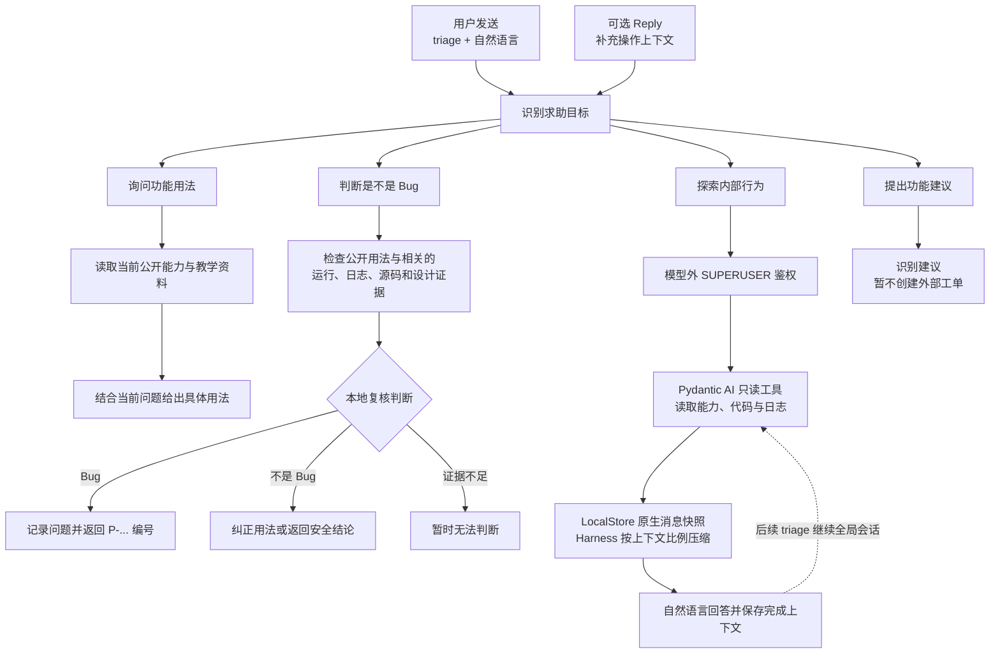
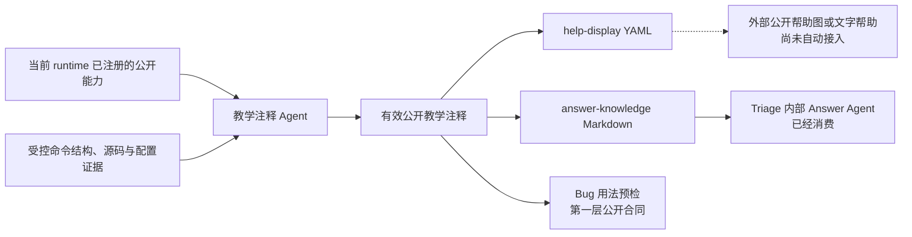

<div align="center">

<a href="https://v2.nonebot.dev/store">
  
</a>

# NoneBot Triage Agent

[](LICENSE)
[](https://www.python.org/)
[](https://nonebot.dev/)
[](https://github.com/Misty02600/nonebot-plugin-triage/actions/workflows/ci.yml)

接收私聊、群聊或频道中的显式求助，并按需关联 NoneBot 本机运行证据。

</div>

## 介绍

发送 `triage <求助内容>` 即可调用插件，`@Bot` 可选。`triage` 后可以直接写自然语言，例如询问功能用法或
描述遇到的问题。回复近期消息时，插件还会尝试关联这条消息在本机产生的运行记录。
只有 Reply、没有 `triage` 的消息不会触发该入口。Guidance / Bug 等普通支持首轮确实缺少用户可以补充的
信息时，插件会在同一 `适配器 + Bot + 会话 + 用户` 作用域保留最多两次补充机会；下一条显式 `triage`
无需 Reply 即可续接。额度用完或得到终局结果后关闭，之后的 `triage` 开启新的短期 Support Thread。

维护者对话是明确的例外：通过 `SUPERUSER` 鉴权后，整个插件部署共享一个可跨 Bot 重启延续的项目会话。
每条新消息仍是一次独立、会结束的 Agent Run；每轮会注入当前 Adapter、Bot、群聊或私聊场景，但场景不拆分
历史。运行中收到新的普通 `triage` 会立即返回忙碌，不排队也不改变当前工作。维护者可用 `triage 停止`
取消当前 Run 并保留快照，或用 `triage 开始新对话` 取消当前 Run 后清空全局会话。
Reply 不选择、恢复或延长 Thread；它的可见正文只在路由后帮助识别具体命令、操作或报错，message ID 则
独立用于关联本机运行证据。



详细状态与失败边界见 [triage 自然语言支持流程](docs/architecture/flows/support-intake-routing.md)。

每次非空 `triage` 都经过版本化语义 assessment service。v8 联合合同接收当前规范化请求、当前可公开
插件目录，以及有界的直接 Reply / 补充问答；一次输出四类目标、独立的现象陈述和公开插件选择。
`guidance`、`behavior_exploration`、`bug_assessment`、`feature_feedback` 最终仍由确定性 router 映射为
唯一 action，模型不能回答、鉴权或直接建单。当前中文
`support-semantic-v8-catalog-prompt-v5-zh` 使用统一 Pydantic AI 设置，当前 semantic 资格集合为空。
Alibaba Qwen3.6 Flash 曾在已删除的厂商专属非思考设置下取得 schema / status 1.000、
exact 0.975；该结果只保留为历史证据，不进入当前资格集合。
router 选择公开能力指导后，插件会从显式 Provider、能力影子与
经校验的教学注释构造只含公开事实的闭合请求，再调用独立的 Answer
Agent 组织自然语言回答。Answer Agent 没有工具，只能把当前问题、公开事实与路由后有界的首轮 / Reply
上下文组织成教学回复；上下文不能覆盖公开事实、权限或披露边界。未明确命中功能时只保留一次补充机会；
正常回答后立即关闭 Thread。失败、超时、未知事实引用或非法输出会退回确定性模板。

当模型识别到用户是在询问“这是不是 Bug”时，会进入独立的只读 Bug assessment。有界 Agent 预加载
已选插件的公开初检事实、当前 Thread 与直接 Reply，并可按需展开成员目录，查询 Reply 关联的运行观察与
异常 traceback、固定 Bot / 群 / 消息锚点附近的聊天、已选插件批准根内的 Python 源码、设计知识包和部署摘要，再由
确定性 reconciler 检查引用、revision、freshness 与 partial 状态。聊天中平台可见的正文按原样提供，不做
凭据或个人信息遮蔽；平台原始 envelope 和用户 ID 不进入模型，源码、日志、配置仍执行原有秘密守门。普通用户
只会收到安全的结论，不会看到源码、日志、配置键或内部责任候选。合格 Agent 确认为 Bug 后，插件使用
NoneBot ORM 在一个事务中保存 Report、Occurrence、Problem 和首条 Decision，并返回 `P-...` 问题编号；
重复 Report 幂等，有可复算的同一技术签名时会关联到已有 Problem。`not_bug` 和 `unknown` 不建立问题记录，
也不会自动创建外部 Issue。当前日志证据只覆盖本插件 runtime hook 精确关联捕获的 Matcher / API 异常，
不会搜索任意宿主文件日志。当前中文 Bug Prompt 为 `bug-assessment-agent-v1-prompt-v23-zh`；生产默认
15 次请求、12 次通用证据、1 次会话读取、300k token 宽松止损，不设默认美元上限；运行期工具定义保持稳定，
接近硬上限时先提示收敛，进入收尾阶段后以 `tool_choice="none"` 禁用调用。

维护者对话把 Pydantic AI 原生 `ModelMessage` 序列保存到 LocalStore data 下唯一的
`maintainer-conversation.json`。文件包含用户与 assistant 正文、完整工具调用/结果，以及 Provider 续接所需的
thinking/signature 元数据；写入使用同目录临时文件、`fsync` 和 `os.replace`。Harness
`SummarizingCompaction` 在上下文达到模型窗口的 80% 时保留最近消息并总结旧历史，压缩后的消息在下一次
模型请求前保存。Agent 可检索 Capability Shadow，并使用项目根目录的只读文件工具查看代码、配置投影和日志；
`.env`、凭据、密钥与数据库等硬拒绝路径仍不会通过工具暴露。

## 安装

```bash
git clone https://github.com/Misty02600/nonebot-plugin-triage.git
cd nonebot-plugin-triage
uv sync --all-extras --group dev
```

基础安装已经包含 Pydantic AI 公共控制层、只读 Harness 与 ty，但不会安装或启用任何模型 Provider SDK。
使用 OpenAI、DeepSeek、Alibaba 等基于 OpenAI SDK 的 Pydantic AI Provider 时安装
`nonebot-plugin-triage[openai]`；Anthropic 部署使用 `[anthropic]`。项目不维护 Provider SDK、模型注册表
或厂商专属 transport。

NoneBot Adapter 由宿主 Bot 按实际平台自行安装并注册。Triage 不提供 `onebot` / `discord` extras，也不会
替宿主注册 Adapter；没有安装 OneBot 时，只会缺少 OneBot 群历史与出站引用等平台增强，通用插件入口和
能力索引仍可加载。

在宿主 NoneBot 项目中加载插件：

```toml
[tool.nonebot]
plugins = ["nonebot_plugin_triage"]
```

首次安装或更新到包含数据库 schema 变更的版本后，在宿主 NoneBot 项目执行：

```bash
uv run nb orm upgrade
```

问题库默认使用 NoneBot ORM 与 LocalStore 管理的 SQLite，Triage 不再增加数据库路径配置。

## 配置

`triage` 命令根、`triage 报错查询` 维护子命令、Matcher 优先级和 2000 字入口上限是当前版本固定的产品合同，
不再通过环境变量改写。以下各项的“含义”直接说明其控制对象、默认行为、作用域与失败边界。

| 配置项 | 默认值 | 含义 |
|---|---:|---|
| `NBTRIAGE_COOLDOWN_SECONDS` | `2` | 同一适配器、Bot、会话和用户每次进入 `triage` 后，在该秒数内再次发送任何 `triage` 请求都会被拒绝；首轮、续问、空输入、超长输入、教学、澄清和报障共用窗口。窗口只在当前进程内存中，重启清空，不是跨进程配额或模型费用预算。 |
| `NBTRIAGE_RATE_LIMIT_MAX_SCOPES` | `4096` | 当前进程入口限流表最多保留的不同 `适配器 + Bot + 会话 + 用户` scope 数；容量满时淘汰最旧 scope 并累计 drop 计数。它限制内存键数量，不提高单个用户频率，也不提供跨进程协调。 |
| `NBTRIAGE_CAPABILITY_VISIBILITY_TIMEOUT_SECONDS` | `0.25` | 收集显式 Alconna 能力时，等待单个第三方 Provider 异步可见性判断的最长秒数；超时、异常或返回 false 的能力不会进入本轮公开说明。它不控制模型请求或能力影子后台刷新。 |
| `NBTRIAGE_OBSERVATION_MAX_ENTRIES` | `10000` | 当前进程最多保留的 NoneBot 生命周期观察记录数，用于 Reply 关联后的可信失败复核；容量满时旧记录被淘汰，原始 API data/result 不会存入该 buffer，重启后清空。 |
| `NBTRIAGE_OBSERVATION_RETENTION_SECONDS` | `900` | 生命周期观察记录可参与 Bug 证据关联的最长秒数；过期记录不能再支持本次关联取证。它不是日志保存期。 |
| `NBTRIAGE_REFERENCE_MAX_ENTRIES` | `4096` | 当前进程最多保留的出站消息引用索引数，用于把用户 Reply 的 `message_id` 精确关联到近期 Bot 运行；容量满时旧引用被淘汰，索引保存 HMAC scope 而不是平台身份原文。 |
| `NBTRIAGE_REFERENCE_RETENTION_SECONDS` | `900` | 出站引用可以被 Reply 命中的最长秒数；过期 Reply 不能再关联本机运行证据。该索引不选择 Thread，也不控制补充机会。 |
| `NBTRIAGE_THREAD_IDLE_SECONDS` | `900` | 未解决首轮等待唯一一次显式 `triage` 补充的最长空闲秒数；成功消费补充、得到终局结果或处理失败都会关闭。 |
| `NBTRIAGE_THREAD_ABSOLUTE_SECONDS` | `1800` | Thread 从首轮创建起不可延长的总寿命；到期后的下一条 `triage` 开启新 Thread。该值不能短于空闲期限。 |
| `NBTRIAGE_THREAD_MAX_ENTRIES` | `4096` | 当前进程最多保存的短期 Thread 数量；容量满时旧状态会被淘汰，重启后全部清空，不是持久会话存储。 |
| `NBTRIAGE_KNOWLEDGE_PACK_AUTO_UPDATE` | `true` | 启动后后台检查当前冻结的 stable catalog，以便新安装取得 NoneBot 2.5.0 知识包；先恢复本地 active 包，资产完整校验后才原子切换。断网、catalog / 下载 / 校验失败均继续使用旧包或降级为 no-knowledge，不阻止插件加载。设为 `false` 可关闭默认联网检查。 |
| `NBTRIAGE_KNOWLEDGE_PACK_URL` | 未设置 | 与 SHA-256 成对固定经过发布审核的 HTTPS knowledge pack 资产，并覆盖 stable catalog；适合离线镜像或可复现实验。固定包安装仍在后台执行；URL / SHA 只配一项或格式非法时只禁用知识服务，不阻止 Bot 启动，也不会偷偷改用 stable catalog。 |
| `NBTRIAGE_KNOWLEDGE_PACK_SHA256` | 未设置 | 与 URL 成对固定 knowledge pack 压缩包的 64 位十六进制 SHA-256；下载内容不匹配时拒绝安装。它校验制品身份，不表示制品来源或许可证已自动获准。 |
| `NBTRIAGE_MODEL_NAME` | 未设置 | 使用 Pydantic AI 的 `provider:model` 选择 Provider、API 族和精确模型，例如 `alibaba:qwen-max`；任意 OpenAI-compatible Chat 服务使用 `openai-chat:<模型 ID>`。这是唯一的 transport 选择字段。held-out 只标记项目已经验证的精确组合，未评测模型不会因此被拒绝运行。未设置时插件仍能启动并提供确定性能力索引，但不会生成教学注释、执行语义分类或调用 Answer / Behavior Agent。 |
| `NBTRIAGE_MODEL_BASE_URL` | 未设置 | 可选覆盖所选 Provider 的部署端地址，例如中国大陆百炼或自建 OpenAI-compatible Chat endpoint。它不替代 `provider:model`；已知 Provider 保留其 ModelProfile，通用兼容服务应显式选择 `openai-chat:`。Provider 构造器不支持地址覆盖时失败关闭。外部地址必须为 HTTPS，HTTP 只允许本机 loopback，且 URL 不得携带凭据、query 或 fragment。 |
| `NBTRIAGE_MODEL_TIMEOUT_SECONDS` | `60` | 范围 `0 < seconds ≤ 400`。这是语义、公开能力回答和维护者 Agent 每次模型请求的最长等待时间；维护者 Run 可进行最多 15 次请求，另有总用量与总时长上限。显式 Provider SDK 对瞬时连接、限流和 5xx 最多进行两次传输重试；教学层不会因此重跑整个 Agent，只保留输出 / 投影 correction。Bug Agent 使用下方独立任务总超时。与已发布评测预算不同只会使组合显示为未验证，不会成为运行禁令。 |
| `NBTRIAGE_MODEL_MAX_OUTPUT_TOKENS` | `240` | 单次语义 assessment 的 output token 上限。该任务关闭 thinking，只进行一次请求。它不限制用户输入长度；与已发布评测预算不同会使用新的未验证质量标签。 |
| `NBTRIAGE_PUBLIC_GUIDANCE_MAX_OUTPUT_TOKENS` | `2048` | 公开 Guidance 单次结构化回答的 output token 上限，范围 `256..8192`；任务关闭 thinking，只进行一次请求。 |
| `NBTRIAGE_BEHAVIOR_MAX_OUTPUT_TOKENS` | `8192` | 维护者 Agent 单次 Provider 响应的 output token 上限，范围 `256..8192`。每个 Run 最多 15 次模型请求、60 次工具调用、512000 total token 和 1 美元预算；对话总轮数不限。整个部署始终只允许一个活动 Run。 |
| `NBTRIAGE_BUG_TIMEOUT_SECONDS` | `300` | 一次 Bug Agent 调查的总墙钟秒数；必须为有限正数。 |
| `NBTRIAGE_BUG_MAX_OUTPUT_TOKENS` | `16384` | Bug Agent 每次 Provider 响应的 output token 上限；必须为正数，实际支持范围由 Provider 合同决定。 |
| `NBTRIAGE_BUG_TOTAL_TOKENS_LIMIT` | `300000` | 一次 Bug 调查累计输入与输出 token 的宽松止损线；包含 Provider 报告的缓存输入，不是严格账单上限。 |
| `NBTRIAGE_BUG_MAX_TOOL_CALLS` | `12` | Bug Agent 的通用证据调用额度；另有一次独立会话读取。模型请求上限自动取该值加 3，默认 15 次，为最终输出和一次纠正保留空间。 |
| 固定任务预算 | — | 自动教学注释使用 32768 单次 output、384000 单元累计 total token、最多 10 次请求和 0.05 美元。Bug Agent 默认不设美元费用上限，也不从单次 output 额度派生累计 output 限制。 |
| `NBTRIAGE_AGENT_TRACE_ENABLED` | `true` | 模型 transport 已配置时，把脱敏后的 Pydantic AI Agent / model / tool spans 写入本插件 LocalStore data 下的 `agent-traces.jsonl`；固定按 10 MiB、5 个备份轮转。文件只含调用结构、耗时、状态、Provider/model、token、费用、安全关联 ID，以及响应 part 类型和正文/工具参数长度等无内容形状，不含 Prompt、源码、模型原文、工具参数/结果或配置值。设为 `false` 时不解析路径、不创建文件。 |
| `NBTRIAGE_CAPABILITY_ANNOTATION_MAX_CONCURRENCY` | `50` | 自动教学注释同时运行的教学单元数上限，接受任意正整数；同一插件的不同单元也可以并行，设为 `1` 可恢复全局串行。HTTP 连接池会跟随该值，但 Provider、网关或操作系统仍可能施加更低的实际并发限制。它不改变单次请求 timeout，较慢 Provider 继续通过 `NBTRIAGE_MODEL_TIMEOUT_SECONDS` 调整。 |
| `NBTRIAGE_RESTRICTED_CONFIG` | `[]` | JSON 数组，列出禁止把实际值交给能力分析模型的 NoneBot 顶层配置键；键名大小写不敏感，`FOO__BAR` 等嵌套写法按顶层 `foo` 整项限制。命中后在读取实际值前拒绝；它不会删除 NoneBot 配置、禁止分析公开 schema/源码，也不表示未列出的整份 `.env` 会被发送。 |
| `NBTRIAGE_EVIDENCE_DENIED_PATTERNS` | `[]` | JSON 数组，为所有只读源码与文件证据根追加相对 POSIX glob 拒绝项；例如 `"private/**"`。它只能在内置硬拒绝之外继续缩小范围，不能重新允许 `.env`、凭据、越界路径或 symlink 外跳。教学和 Bug 仍分别应用自己的任务级拒绝与日志准入规则。 |

`provider:model` 由 Pydantic AI 解析，不需要 Triage 为每家服务增加 backend。常见填写方式如下：

| 服务 | `NBTRIAGE_MODEL_NAME` | `NBTRIAGE_MODEL_BASE_URL` | 密钥环境变量 |
|---|---|---|---|
| DeepSeek | `deepseek:<模型 ID>` | 不设置 | `DEEPSEEK_API_KEY` |
| 中国大陆百炼 | `alibaba:<百炼模型 ID>` | `https://dashscope.aliyuncs.com/compatible-mode/v1` | `DASHSCOPE_API_KEY` 或 `ALIBABA_API_KEY` |
| 国际站 DashScope | `alibaba:<模型 ID>` | 不设置 | `DASHSCOPE_API_KEY` 或 `ALIBABA_API_KEY` |
| Google Gemini API | `google:<模型 ID>` | 不设置 | `GOOGLE_API_KEY` 或 `GEMINI_API_KEY` |
| 其他 OpenAI-compatible Chat 服务 | `openai-chat:<模型 ID>` | 服务商提供的 HTTPS API 根地址 | `OPENAI_API_KEY` |

例如，Google Provider 可以这样填写：

```dotenv
NBTRIAGE_MODEL_NAME=google:gemini-2.5-flash
```

中国大陆百炼继续使用 Pydantic AI 官方 `alibaba` Provider，只覆盖部署端地址：

```dotenv
DASHSCOPE_API_KEY=<百炼 API Key>
NBTRIAGE_MODEL_NAME=alibaba:qwen-max
NBTRIAGE_MODEL_BASE_URL=https://dashscope.aliyuncs.com/compatible-mode/v1
```

`qwen-max` 是示例模型 ID，不是 Triage 强制的默认模型。部署者应从
[百炼模型列表](https://help.aliyun.com/zh/model-studio/models)选择当前账号可调用且满足任务需要的模型，
把其精确 ID 放在 `alibaba:` 后面；Triage 不维护容易过期的模型名白名单。

不设置 `NBTRIAGE_MODEL_BASE_URL` 时，`alibaba:<模型>` 使用 Pydantic AI Provider 的默认国际站地址。Base URL
只是受信任的部署配置，不是新的 Provider 名称；Triage 通过 Pydantic AI 原生 Provider factory 保留 Alibaba / Qwen
的 ModelProfile。两种地址都需要安装 `openai` Provider 依赖。Coding Plan / Token Plan 专属 Key 不适用于
Bot 后端或自动批量生成。

其他 Pydantic AI Provider 也可以在其构造器支持时使用同一 Base URL 字段；只有兼容 Chat URL 时使用
`openai-chat:<模型 ID>`，不需要新建项目 backend。自定义地址默认标为未验证，
更换地址会使教学注释缓存失效；脱敏 Agent 轨迹只保存地址的 SHA-256 身份，不保存完整 URL。API Key 仍只用
Provider 的标准环境变量配置，不能写进 Base URL 或 `NBTriageConfig`。

部署者还需安装该 Provider 的 Pydantic AI SDK 依赖并配置其标准密钥环境变量。项目支持矩阵中的 held-out
结果用于说明已验证质量，不是运行白名单；未评测组合仍执行相同 schema、Evidence、安全和预算检查。

密钥只从对应 Provider 的标准进程环境变量读取，不写入 `NBTriageConfig`；例如 DeepSeek 使用
`DEEPSEEK_API_KEY`，中国大陆百炼使用 `DASHSCOPE_API_KEY` 或 `ALIBABA_API_KEY`。
`NBTRIAGE_MODEL_BACKEND` 已删除；配置中出现该字段会被明确拒绝，必须改成 `provider:model + 可选 Base URL`。
语义 assessment 只发送当前单条、
规范化并通过秘密守门的 `triage` 请求文字，不接收 Reply 或 Thread。公开能力 Answer Agent 在路由后另接收
同一问题、本轮已经过滤为 public 的能力事实，以及有界的首轮 / 直接 Reply 可见正文；上下文不能成为能力
事实或权限。两类请求都不接收配置、环境变量、日志、源码、运行证据、证据位置或 restricted 能力，并各自
最多一次请求、零自动重试、不切换模型。
语义失败会 abstain；回答失败或非法引用会退回确定性模板。语义客户端使用 Pydantic AI
`Agent(output_type=SupportSemanticAssessment)`；结构化输出方式完全由所选模型的 Pydantic AI
`ModelProfile` 决定，项目不会按厂商改写请求或建立专属 output tool 合同。

Bug assessment 使用独立的数据与任务合同。它可以把与本案相关、已经绑定 subject / revision / correlation
并清理秘密的源码、关联异常日志、完整 traceback 与获准设计摘录发送给 Bug Agent；直接 Reply 与模型外
固定锚点读取的同群可见聊天正文则原样提供，不执行凭据或个人信息遮蔽。它不会上传整个仓库、任意文件日志、
平台原始 event、原始用户 ID 或配置。Agent 直接使用 Pydantic AI 原生
`Agent(output_type=BugAssessmentCandidate)`、`Tool`、`ModelProfile` 和 `UsageLimits`，模型候选不能绕过
本地 reconciliation，也不能写问题库、发送额外消息或执行插件代码。
Bug 的源码工具只在当前已加载 subject 的批准插件根内执行有界 Python 文本搜索和按文件读取；它不会启动
外部语言服务器、读取整个仓库或越过路径、文件大小与结果数量门禁。共享的 ty
`go_to_definition` 与只读 FileSystem 目前服务教学注释，尚未接入 Bug。

Answer Agent v2 使用 `Agent(output_type=PublicGuidanceAnswer)`，输出最多 1000 字回答及实际使用的公开事实
ID；它不执行命令，也不能把模型文本升级为工具或授权。该回答任务已经完成闭合 schema、假 HTTP、Handler
回归和两条真实 Provider smoke：Reply 指代能定位“搜图”用法，恶意 Reply 文字不能覆盖公开权限事实。它尚未
完成独立真实模型 held-out 回答质量 Gate，因此没有项目验证质量标签；这不阻止部署者实际使用。

当前语义字段的中文对应为：`guidance`（公开能力指导）、`behavior_exploration`（行为探索）、
`bug_assessment`（Bug 判定）、`feature_feedback`（功能建议）；另有
`reported_observation`（用户陈述当前或过去真实发生过 Bot 行为）。公开能力、语法、参数、公开角色、场景和
前提由 guidance 回答；需要源码、内部配置、环境、版本、调用流或运行证据的内部原因进入 behavior
exploration。分类不接收身份，选中行为探索后才执行模型外 `SUPERUSER` 鉴权。
Bug 判定同样不依赖身份，但它只回答三值结论；如果用户明确要求查看源码、配置、环境、版本、调用流或运行
证据本身，才属于 behavior exploration，并在分类后执行 `SUPERUSER` 鉴权。一次请求可以识别多个目标，
router 仍只执行一个动作。

配置模型 transport 后，脱敏 Agent 轨迹默认写入同一插件 data 目录下的 `agent-traces.jsonl`。它和普通告警
日志互补：日志快速指出失败单元，trace 用共同的 trace ID 串起 Agent run、模型请求、工具调用、重试、耗时和
token。教学注释还会写入独立的无内容 response-shape span，记录最终响应的 part 类型、文本/思考/工具参数
字符数，以及能够完整解析时的 entry、claim 和 constraint 数量。轨迹
不会保存生成所用的源码、Prompt、模型原文、工具正文或配置值，也不会自动上传；可通过
`NBTRIAGE_AGENT_TRACE_ENABLED=false` 完全关闭。部署者可以先用 `nb localstore data` 查看 LocalStore data
基目录；插件启动日志也会打印本次解析出的 `agent-traces.jsonl` 完整路径。
维护者运行精确单插件 `analyze-capability-teaching` 时，可以用 `--capture-model-output <path>` 把成功或失败
尝试的完整 assistant 文本、thinking、tool call/result、correction，以及 Provider 返回的有界脱敏 HTTP
错误正文写入显式本地忽略路径；该文件不保存初始 Prompt、请求体、认证头或 API key，但 reasoning、工具
返回与上游错误仍可能包含真实插件源码或其他敏感上下文，必须按敏感本地工件管理。配套 `--unbounded` 会移除
项目侧请求、工具、token、输出和成本止损，但仍保留 Agent 超时与轮内输出纠错，不自动重跑整个单元；不影响生产 trace 默认脱敏。
同一 Prompt、request、源码和已发布 generation 下，维护者可加 `--retry-failed` 复用成功单元，只重新生成
失败、缺失或 stale 单元；合同 revision 变化时旧成功缓存同样失效，因此首次运行新合同仍会全量生成。
该维护命令会把目标插件自己的 LocalStore cache/config/data 重定向到本次临时目录，避免插件加载或旧数据迁移
读写部署者真实数据；Triage 自己的教学 cache、generation 与诊断输出仍按宿主项目配置保存，便于复核结果。

教学冷测复用同一维护命令的 `--phase preflight|run`，无须另写批次 runner。两种模式共用宿主、适配器加载、
知识包准备与正式 `refresh_teaching()`；`--all` 将宿主 `tool.nonebot.plugins` 声明的插件（排除 Triage）
作为一组目标，仅构建一次宿主快照并执行一次批量刷新，
也可用 `--plugin <导入名>` 指定一个插件。它们不启动 Bot、连接适配器或执行插件启动钩子。

```powershell
uv run python -m tools.nbtriage_maintainer analyze-capability-teaching `
  --host-pyproject E:/Bot/pyproject.toml --all `
  --phase preflight --knowledge required `
  --knowledge-archive E:/Packs/knowledge.zip --knowledge-sha256 <归档的64位SHA256> `
  --run-dir reports/teaching-preflight-001
```

预检使用当前配置的真实模型/Profile、正式请求预算和工具组装，在第一个模型请求发出前截停，**不调用 Provider**。
`preflight_ready` 表示首轮模型输入已构建，不验证 Provider 专属 HTTP 编码或服务是否接受请求，也不代表注释生成成功或语义正确。
日常生成直接复用这些准备步骤并继续请求模型，不会额外先跑一遍预检。预检的内部教学状态使用临时目录，
结束后清除；报告保留准备失败、预算失败和跳过原因。没有任何单元进入模型阶段时返回失败，不能把空跑算作通过。

正式运行将 `--phase` 改为 `run`，并使用另一个尚不存在的 `--run-dir`。此操作会调用配置的模型并产生费用。
两种模式都要求新运行目录，正式运行的 LocalStore 状态保存在其中；宿主和所有插件的 LocalStore 基目录及
单插件覆盖项都被隔离。插件加载仍执行其 Python 导入代码，隔离范围不包含插件自行访问的其他文件或网络。
`--knowledge required` 必须提供本地归档与 SHA256，直接激活同一个运行时知识服务，检查适用版本的用户文档，
并在每个单元的首个模型请求前确认 `framework_search_docs` 实际存在；失败时不回退到无文档模式。
后续正常耗尽补证预算时沿用正式管线的工具撤下与最终提交行为。
对照组显式指定 `--knowledge off` 并省略归档参数。正式运行使用正常预算，不接受 `--unbounded` 或 `--retry-failed`。

每次生成 `manifest.json`，记录代码摘要、请求/分析 revision、模型/Profile、预算、知识包摘要与检索器版本、
实际首包工具、输出方式及 Schema 摘要、输入 token 估算、各单元状态和请求数。正式运行另复用现有 `model-output.json` 与生命周期日志。
报告和生成目录属于本地工件，按上述诊断数据规则管理。预检不验证远端认证、计费、模型响应或检索带来的教学质量；
后续真实冷测与人工语义评审继续独立记录，不能用缓存命中率、生成成功率替代质量结论。

教学 fixture 评测使用 Pydantic Evals 2.43.0 调度，继续调用现有教学分析与领域评分函数。维护者安装
`uv sync --group maintainer` 后，沿用 `evaluate-capability-teaching` 的模型、预算与付费确认参数，并显式提供
本次冻结 Fixture 路径、集合 ID 与内容哈希；仓库不再把已消费的旧合同默认为当前资格集。可加
`--repeat 3` 独立运行每题三次。重复次数大于 1 时只形成诊断结果，不授予模型资格。总预算覆盖全部重复，
达到阈值或无法确定费用后不再创建后续模型客户端；已开始的一例仍可能使总费用超过阈值，因此它不是请求内
的美元硬上限。SDK 重试与教学轮内纠错沿用实际模型配置，评测层不自动重跑失败任务。

正式 JSON 报告保留逐例结果与质量门槛，新增执行/评分失败、未执行计数、重复运行名称、评分版本，以及复评
所需的请求与输出快照。报告包含合成源码证据，属于本地工件，不自动上传。项目不再依赖 MLflow，也不再提供
实验平台发布或服务器启动命令；评测直接保存本地 JSON，支持离线复评。
原生框架平均分不作为资格结论，未执行或评分器故障使本次实验不完整。历史 v8–v13 fixture 的请求合同与当前
生产合同可能不同，版本或源码审计不通过时应保持拒绝，不能通过修改历史预期来制造新的合格结论。

离线复评读取上述完整报告，不需要模型凭据、付费确认或原 fixture 目录：

```powershell
uv run --group maintainer python -m tools.nbtriage_maintainer replay-capability-teaching `
  --source-report reports/teaching-original.json --report reports/teaching-rescored.json
```

复评使用保存的最终投影与模型输出，执行当前评分规则，不重新生成或重新投影；原报告不会被覆盖。新报告记录
来源文件摘要、原评分版本及当前评分版本，原生成费用放在 `generation_usage`，本次请求数和费用为零。
缺少必要快照、只有 partial 报告或请求 revision 不兼容时拒绝复评。复评结果不构成新的独立冷测或资格证明；
真实宿主冷测的 `manifest.json` 也不直接作为 fixture 复评输入。正常运行和复评都要求新的报告路径。

`NBTRIAGE_RESTRICTED_CONFIG` 的 JSON 数组格式示例：

```dotenv
NBTRIAGE_RESTRICTED_CONFIG='["DISCORD_BOTS", "PLUGIN_COOKIE"]'
```

### 指令教学数据

指令教学注释在后台按能力 revision 生成并复用缓存，不会在每次用户提问时重新分析源码。一次有效分析会
投影为面向公开展示和内部回答的两类数据：



配置了可用的模型 transport 后，后台教学注释任务会把本轮所有符合准入条件但没有有效缓存的当前能力作为
独立教学单元放入同一个有限并发池；同一插件的不同单元也可以并行。每个单元从当前 runtime
snapshot 出发，先提供确定性的命令结构、ast-grep Matcher 结构、已加载 handler 片段和当前内存配置投影；
随后用 Python AST 枚举调用位置，并复用 DefinitionNavigator 优先补入唯一可定位的未解析自定义
Permission/Rule 定义，再按广度优先展开本地 helper。定义导航唯一定位到当前解释器 purelib / platlib 或生效的
site-packages / dist-packages 中的直接外部函数时，首包会预载这一层完整函数，但不把外部函数继续加入 BFS；
过长或无法切片的唯一定义只提供不可引用的精确读取目标。编译扩展仅有 `.pyi` 时只提供签名导航，不把签名
当成业务行为 Evidence。
注册 gate 若先指向目标插件模块级赋值，适配器会沿静态、唯一的绑定链保存相关语句，并按同一预算预载最终
到达的一层外部函数；不会为权限库或插件编写专属解析器。初始与动态 Python Evidence 会给直接调用、装饰器
和基类附带请求内位置句柄；Agent 只提交句柄，服务端用定义导航完成跳转、revision 复核和唯一目标的稳定读取，
不再让模型计算行列或复制源码哈希。
Handler 与自定义 gate 为深度 0，最多展开三层；单函数最多 8,000 字符，单教学单元的初始源码切片合计最多
32,000 字符。动态分派、多定义和解释器根外位置不会被猜测成正式 Evidence；普通单元仍可由 Agent 使用现有只读
工具沿精确位置按需调查。静态工厂 family 的 Handler 若访问成员 Callable 字段，且字段值唯一解析为目标插件
本地函数，首包会按定义去重加入这些函数，但不递归展开或逐成员调用 Agent。参数化 family 只有在每个成员的注册级
Permission/Rule 都能形成同一个有证据的共同合同后才会合并：已识别权限成为固定约束，共享自定义 gate 合并成一个
family candidate 并附带唯一插件内定义；成员合同不一致、动态不透明或定义不唯一时整项 fail-closed。源码 revision
漂移则拒绝混用两代 Evidence，并停止该插件本轮剩余教学分析。确定性切片只在进程内按源码 revision 与函数定义身份复用，
每个教学单元仍生成自己的 Evidence ID 与 manifest。
初始 Evidence 不足时，Agent 才能在批准的 Bot、插件与 LocalStore 根中使用只读 glob/search/read，或用定义导航
从已读 Python 标识符转到当前解释器依赖的定义。当前解释器依赖根自动按 Python-only 安全策略接入，无需逐包
批准；依赖根不允许自由 glob/search，只允许按已知位置读取；`.env*`、
凭据、数据库、教学日志、人工维护的帮助 YAML、评测 Gold 和本任务生成的 help-display 始终不能进入教学模型。
Bot 项目根只用于非 Python 项目文本和配置，Python 源码必须从本轮已加载目标插件的独立源码根读取，不能
借项目根遍历其他本地插件。
配置当前值只从已构造且与源码引用匹配的 Pydantic 实例投影，并在读取前应用
`NBTRIAGE_RESTRICTED_CONFIG`，不会读取整份 Config、消息、用户身份或枚举进程环境。

教学刷新以稳定部署为前提：已加载的插件、依赖与磁盘源码应属于同一部署版本，分析期间不要修改它们。
更新代码或依赖后应重启 Bot，由启动刷新重新判断缓存是否有效；符合复用条件的注释保留，失效项重新生成。
运行中的 `triage 刷新帮助 [plugin_module]` 只刷新当前已加载能力的教学知识，不会热重载 Python 模块、
重新注册 Matcher 或重新读取 `.env`。仅修改磁盘文件后直接刷新帮助，以及第三方热重载过程，不在当前保证范围内。
现有 revision 检查用于拒绝检测到的源码漂移，不是持续文件监听，也不能证明内存中的旧代码已随文件更新。
具体边界见[教学刷新与部署变更](docs/architecture/flows/capability-shadow-index.md#教学刷新与部署变更边界)。

模型输出必须引用本轮初始 Evidence 或成功 `read_file` 返回的动态 Evidence。教学 cache 按插件写入 Triage
LocalStore cache 的 `capability-annotations/<module_name>.json`，同一文件内按 teaching unit 保存
`last_good` 与 `last_attempt`。`last_good` 是最近通过完整校验的公开结果；`last_attempt` 只记录最近真实生成
尝试的状态、阶段、请求指纹和脱敏失败原因，失败不会覆盖仍精确有效的 `last_good`。cache 不保存源码正文或
配置值，只保存公开教学文本、请求指纹，以及用于复核动态证据是否仍有效的 Evidence ID、相对位置和文件
revision。每个分片还绑定实际发布它的 `published_generation`；只有它与 `current.json` 一致，且能力仍于当前
runtime 成功注册、插件源码与其他生成输入未变、动态证据 revision 仍匹配时，旧结果才能提供。因此缓存写入
落后、插件加载失败或本轮未观察到的能力都不会成为普通用户可见的“幽灵帮助”。插件文件
直接使用安全的 `module_name.json`，不建立 hash fallback 或文件名映射；非法 module name 或同轮大小写折叠
冲突只关闭相关插件的教学增强。未评测模型也可以生成，但仍须通过
相同的模型外闭合检查，并以未验证质量标签记录。Prompt、request 与 Schema 版本以
[教学合同常量](src/nbtriage/capability/teaching/annotations.py)为准。当前教学 Schema 的公开 entry 只保存
`name / summary / usages / search_terms / behavior_boundaries / requirements`。独立条件继续使用
`role / scene / access / rate_limit`；一个 Permission 的组合资格使用带 OR alternatives 的单一 requirement。
`role` 表示调用者本人身份，`access` 表示用户、群或场景已取得由高权限主体控制的脱敏使用资格，业务准备状态进入
`behavior_boundary`。`platform_scope` 只由 Runtime 记录负责路由，不进入模型生成的公开注释。
Migut Help 只把单一 `SUPERUSER`，或精确的 `admin OR owner` 管理员组合投影为原生 permission；含场景、
频道管理员或 custom 的混合 OR 留给 Answer。Alconna 叶子仍可投影为多个模型外固定 ID 的 entry；模型不再生成
自由 Answer Markdown，Help 与 Answer 都从同一结构合同确定性投影。同一位置的一至三项固定备选在 usage 显式枚举，
四至六项使用概念槽并在 summary 说明，七项及以上使用概念槽、允许简短概括但不得逐项列出；该规则同时适用 family、单个 Matcher 的多命令头、
别名、Option 和固定参数值。

历史 schema 曾允许 Alconna 子命令分别成为帮助条目，Option、别名和同功能用法留在同一 entry；模型直接返回完整命令正文，不再使用
`{command}`，也不再输出结构化 interaction。2026-08-16 的全新 v3 24 条真实 Provider held-out 中，schema、
Evidence 闭合、投影、预算、工具与 12/12 源码提取均通过，但安全率 0.9167、语义率 0.3333，质量 Gate 仍失败，
因此不能继承 semantic、Bug 或 Answer 任务的质量结论，也不宣称该精确组合具有同等已验证质量。
历史 v35 Prompt 又复用了同一批 20 条案例和 12 组冻结源码，对国内 Alibaba Qwen3.6 Flash 独立运行 v9
forward-heldout。源码提取率为 1.000，但 schema / Evidence / 投影 / 安全 / 预算均为 0.900，语义率为
0.600，需要补读工具的案例未通过，正式 Gate 失败；因此 Qwen 能力标注仍只属于“可运行、未验证”，不会进入
`QUALIFIED_CAPABILITY_ANNOTATION_TASKS`。
2026-08-19 又用旧 request v2、Prompt v38 和 fixture schema v4 运行全新 v12：12/20 案例通过真实
production request builder，整批 20 条中 16 条通过；schema / Evidence
闭合为 0.950，投影 / 安全为 0.900，语义为 0.800，工具案例为 0.500，预算与源码提取均为 1.000。33 次请求
共 197,757 input / 110,238 output tokens，按冻结价格审计为 37,169 microUSD，正式 Gate 失败，因此当前请求
合同不登记能力注释质量资格。v12 暴露了输入 requirement 重复、`@` 公开文字过度拒绝、基线细化语义和截断后
correction 责任难以判断等问题，这些问题推动了 Prompt v39 / request v3 / schema 7 收敛。已消费的 v12 保持冻结历史证据，
不会通过事后修改 Oracle 或 Prompt 重新冒充 held-out。
同日又对 Prompt v39 / request v3 / schema 7 运行全新 v13：20 条中 12 条通过真实 production adapter
builder，24 次 Provider 请求共 132,972 input / 65,381 output tokens，按冻结价格审计为 22,670 microUSD。
schema、Evidence 闭合、投影、安全、预算、工具和源码提取均为 1.000，语义为 0.800，低于 0.900 门槛，
因此正式 Gate 仍失败，`QUALIFIED_CAPABILITY_ANNOTATION_TASKS` 仍为空。四条自动失败中，人工复核确认三条是
过窄 Oracle：自定义角色同义文案、`baseline_changes.replace.new_value` 已形成正确最终边界却仍被要求重复 claim，
以及 `@值班员` 的正确详细改写未逐字等于期望；剩余一条是模型把按群名单限制错分为 `scene` 而非 `access`。
v13 分数保持冻结，不用事后改 Oracle 冒充通过。
当前教学合同保留全部 family 成员调用事实，并把无损列式成员清单与唯一 Parser shapes 分离去重；模型输入不再重复 Runtime 已拥有的 `platform_scope`。独立 scene requirement 携带 `allowed_scenes` 条件集合（包括 `non_private` 谓词），同一注册表达式中的复合 Permission 只形成一个候选。真实限额允许在同一 requirement 中说明有 Evidence 支持的豁免对象，不再用公开短语黑名单误杀。现有 Evidence 不足以支持或否定拟公开事实时，Agent 可以从已知符号、路径或调用位置按需补证，不限定为配置或授权问题；定义导航和根内文本搜索分别负责理解符号与定位使用位置；初始和动态 Python Evidence 提供请求内位置句柄，唯一目标一次调用即完成定义跳转、revision 复核和可引用读取。role 按入口直接身份判断生成，access 按可配置权限、名单或开放资格查询生成；权限系统内部的角色预授权不反向展开为目标能力 role。Alconna 联合输入不会再退化为 `typing.Any`，Uniseg `At` 会作为直接 `@用户` 输入参与聚合 usage 完整性校验；七个及以上 family 成员只做简短类别概括，不在 summary 或行为边界重复完整成员名单；tool-mode 与 native-mode 都直接提交顶层教学分析对象，不接受 `output` 包装或 JSON 字符串；输出格式或投影错误最多纠正两次；
普通命令明确保持 anchor-only。合同继续移除 family 初始 Evidence 条目总数上限、过滤
Alconna 内建辅助 Option，并把公开投影失败纳入一次定向纠错；展示继续采用 `≤3 / 4–6 / ≥7` 阈值。
family 异构输入无法用一个词准确概括时使用由当前 Evidence 命名的概念槽位，Prompt 不提供固定成品词；四至六类在 summary 说明，七类及以上可以简单概括共同类别，但不逐类展开，
“参数”与其他槽位名称使用相同的通用校验，不设置专门门禁、优先级或强制说明。目标插件文件工具统一使用 `target_plugin_*` 和相对插件根路径；
外部插件请求不再暴露无关的 `bot_project_*`，本地宿主插件或已有宿主 Evidence 才保留；文件搜索只在
单个根内做文本检索，已知 Python 调用位置使用定义导航跨安全根导航；唯一直接外部函数预载一层，过长定义只给
精确读取目标，不递归展开依赖树，初始 Evidence 已完整提供的函数也不重复整文件读取。它改变了
模型输入和生成合同；静态 family Callable、Permission OR alternatives 与 SDK 重试边界也已变化，不能继承
v13 质量结论，仍标记为未验证。

一次可发布刷新先在内存 staging 中形成候选，再从同一份候选生成两类一插件一文件的数据：面向外部公开帮助
消费者的紧凑 YAML 和供 Answer 补充公开细节的 Markdown。它们写入 Triage 自己的 LocalStore plugin data：
`capability-teaching/objects/<generation>/help-display/<module_name>.yml` 与
`capability-teaching/objects/<generation>/answer-knowledge/<module_name>.md`。两类文件和 manifest 全部写完后才
完成校验并原子替换 `capability-teaching/current.json`，指针切换成功后才提交对应 Answer 内存视图，所以不会
出现一半新、一半旧。`current.json` 是唯一活动指针；cache、内存 staging、最近尝试记录和未被指针选中的
generation 都不是正在服务的教学合同。Help 与 Answer 文件不包含
源码、Evidence、配置值、指纹或审核状态；同 generation 的 `manifest.json` 保存脱敏的单元状态、fingerprint、
动态 Evidence 位置/revision、尝试次数，以及每个插件的 `partial` 和 `active/eligible` 数量。
`capability-teaching/last-refresh.json` 原子记录最近一次刷新尝试，即使该轮因全局可信度失败而没有发布。
当前版本不设草稿或审核流程，也没有把 YAML 目录接入外部帮助系统；这些文件目前用于
部署者观察效果，并由 Triage 的 Answer 公开教学视图消费。

教学内容按普通 Matcher 或参数化 family 为不可拆分单元 fail-closed，而 generation 仍整体原子发布。单个普通
Matcher 失败只关闭该单元；family 失败会关闭整个 family。同轮其他成功单元，以及请求指纹、插件 revision 和
Evidence manifest 仍精确匹配的 `last_good`，可以进入 partial generation；失效旧注释不会继续发布，普通检索
回退到确定性能力信息。插件文件会显示“目前可说明以下功能（n/m）”。插件源码 revision 与 cache 不同时，
首版全量重生成该插件当前教学单元；Agent 运行中发现 `SOURCE_CHANGED` 时，已生成和已复用的该插件内存
staging 一并作废，后续单元停止，但其他插件仍可发布。快照 partial、共享 Provider / Schema 身份失败、
HTTP 401 或 generation / `current.json` 原子发布失去可信度时整轮不切换。下一轮会复用仍精确匹配的
`last_good` 并只补做缺失或失败单元；配置、Provider / endpoint / model、Prompt / Schema revision 或 Evidence
manifest 变化会使对应单元重新生成。

带闭包 Handler 的参数化 Matcher 不再逐条重复调用模型：Triage 只在 Runtime code identity 能精确定位同一段闭包
Handler、该身份的所有 Runtime 成员都通过公开准入，且共同注册 gate 合同可安全表达时，把它们作为一个分析单元。
模型阅读共享 Handler、确定性展开的本地依赖和批准 Evidence，
能形成可靠共同说明才启用知识；适配器无法安全表达时该 family 直接关闭，模型选择 abstain 时缓存
`knowledge_enabled=false`，两种公开文件都不生成该条目。首版仍
排除全局消息、通知、请求和其他没有确定公开触发形式的被动监听器。
family 请求会携带本轮全部公开成员的确定命令、alias 和 Runtime parser 参数结构；成员参数数量、图片或文字输入、
必选性和精确 usage 不同不再关闭共同知识。查询先按 family 去重，精确命中成员时从当前 Runtime record 重建它的完整
usage，普通 family 查询使用聚合 usage。这不是新的 LLM 工具，也不为单个插件增加 `members / variants / catalog` schema。
聚合 usage 选择 Evidence 支持的最窄共同输入角色；四至六类输入在 summary 说明，七类及以上可以简单概括共同类别，但不逐类列举。已发现的 gate candidate 需要由 constraint 关联；Handler/helper Evidence 直接证明的其他执行限制即使没有 candidate 也仍可公开，不能把“没有候选”误解成“没有限制”。
压缩后的占位符仍只是聚合概览，不能被解释成每个成员都具有相同的完整调用合同。

## 使用

普通用户入口可以在私聊、群聊或频道直接发送，也可以 `@Bot` 后发送；三种会话使用相同分流和调用者
鉴权规则。私聊目前不能建立故障记录，维护命令仍需要 `@Bot`。配置的 Provider/model 可由 Pydantic AI
解析、所需 SDK 和密钥可用且传输能力满足当前任务时，下表的 `triage` 场景会调用在线语义分类。当前
semantic 没有任何已验证模型组合；所有 Pydantic AI 可解析组合都按未验证运行。使用已删除专属设置的
held-out 结果只保留为历史证据，不能继承为当前资格。

| 指令                                              | 权限      | 说明                           |
| ------------------------------------------------- | --------- | ------------------------------ |
| `triage 某个功能怎么使用`                         | 所有人    | 说明当前平台确定公开的功能     |
| 同一会话继续发送 `triage <补充>`                  | 所有人    | Guidance / Bug 调查前澄清共用最多两次补充；Reply 可选 |
| `triage <公开能力问题>`                            | 所有人    | 检索当前平台可安全说明的能力   |
| `triage 刷新帮助 [plugin_module]`                 | SUPERUSER | 强制刷新全部或指定插件模块的教学数据 |
| `triage 查看帮助边界 <plugin_module>`              | SUPERUSER | 查看已发布原始边界、版本和单元 / 条目 ID |
| `triage 修改帮助边界 <generation> <unit_id> <entry_id> "原文" "新文"` | SUPERUSER | 精确替换一条已有边界，不调用模型 |
| `triage 这是不是 Bug`                             | 所有人    | 判断 Bug / 非 Bug / 未知；确认 Bug 时自动记录 |
| `triage <项目问题>`                                | SUPERUSER | 在部署内唯一的长期会话中使用只读工具交流项目内容 |
| `triage 停止`                                      | SUPERUSER | 取消当前 Agent Run，保留最近成功会话快照 |
| `triage 开始新对话`                                | SUPERUSER | 取消当前 Run 并清空部署内全局维护者会话 |
| `triage 报错查询`                                 | SUPERUSER | 列出当前所有待处理 Problem |
| `triage 报错查询 <P-编号>`                        | SUPERUSER | 查看判断、报告/发生次数和状态 |
| `triage 报错查询 <P-编号> <确认Bug/确认非Bug/解决>` | SUPERUSER | 追加人工 Decision 或标记已解决 |

跨平台命令、结构化 Reply / Target 与回复发送由 Alconna / UniSeg 提供；Thread 由插件自己的 HMAC scope
索引校验 `adapter + Bot + conversation + actor`、有效期和单活动 lease。等待补充只要求当前回答发送成功，
不再要求 Receipt 返回 message ID。OneBot 的全局出站 Provider 继续只负责运行证据 correlation；Reply 正文
可进入路由后的 Guidance / Bug 上下文，但不能改变 Thread 归属或权限。

人工微调先用“查看帮助边界”取得版本、ID 和完整原文，再用“修改帮助边界”替换；文字中有空格时须用引号包裹。
只允许修改现有 `behavior_boundary`，不能通过该入口更改 usage、权限、场景或自动派生的参数数量说明。
旧版本、原文不匹配、源码或 Evidence 已失效时会拒绝。旧格式发布没有结构化恢复材料时，须先完成一次正常刷新。
编辑会重新准备选中单元以核对当前性，但不请求模型；成功仅表示结构合法，不代表语义已验证。
人工文字随新教学版本发布并成为后续生成基线，模型未提出变更时保留，明确替换或删除时可以更新；它不是永久覆盖。
结构化注释与编辑记录保存在 LocalStore data 的教学 generation 中，应随数据备份，不能当作可丢弃缓存清理。
记录包含操作者标识及修改前后文字，不属于公开 Help / Answer 文件，分享诊断材料前须脱敏。

### 本地能力影子索引

能力影子默认启用，并使用 LocalStore 管理的插件 cache；部署者不需要也不能通过 Triage 配置指定 SQLite
路径。它是可删除重建的派生索引，不是用户数据或权威状态；文件位置、文件名和数据库格式不属于公开合同。

启动钩子只调度后台刷新，不等待制品扫描或索引构建；实际工作通过线程执行，不阻塞 Bot 启动关键路径。
后台任务读取标准 `pyproject.toml` 的 NoneBot 声明、安装制品 revision 和实际已加载模块做
`registered / not_observed / runtime_only` 协调，再从已加载的 Plugin、Matcher、Alconna 结构、插件元数据
和轻量本地源码摘要原子生成全文索引。同一轮 deployment 构建只枚举一次 distribution package map。每个
命令或 Matcher 保持独立记录；基础索引不分析 handler 效果、推断跨 Matcher 角色，也不做逐文件模块源码对齐。它不调用
第三方 Rule、Permission、handler 或命令解析，也不读取
`.env`、日志和运行数据。每条记录分别保存 `public / restricted` 受众、`all / explicit / unknown`
平台范围、具体 `analysis_issues`、执行约束和记录状态。确定命令入口、当前 adapter 在范围内、没有分析问题、
记录状态不是 `conflicted / stale`、快照明确完整且索引新鲜时才进入普通用户检索。启用自动教学注释时，
源码分析只补充满足这些运行时条件的现有记录，不会把静态扫描结果升级成“当前可用”事实。动态、被动、冲突或证据
不足的能力会保留对应 issue，不要求部署者逐命令审核。代表部署开发 / 维护者的 `SUPERUSER`、
`CommandMeta.hide=True`
或停用能力会以 `restricted` 写入本地索引，但普通检索不会返回。只有先在模型外确认
当前调用者有权查看的路径，才能检索这部分能力。Token、配置原文和私密日志不是能力，始终从采集源排除；
部署者以后也可以通过独立的 operator exclude policy 在持久化前完全排除某些能力。

源码仓库中的维护命令可以检索该索引：

```bash
just maintainer search-capabilities "搜图怎么用" \
  --index data/nbtriage-capabilities.sqlite3 \
  --include-unresolved
```

本地维护者已经在模型外确认自己有权查看当前部署的内部能力时，可以额外使用 `--include-restricted`。CLI
开关只是声明带外授权，不自行检查身份；语义 router 选中行为探索后，私聊、群聊和频道中的 `triage` 都会
对当前 Bot / Event 的请求者执行同一 NoneBot `SUPERUSER` 检查。维护者 Agent 在每次模型请求和工具执行前
重新鉴权。它可读取 Capability Shadow 与项目根目录内的只读文件，并把本轮使用的原生消息上下文完整保存；
工具仍硬拒绝 `.env`、凭据、密钥和数据库路径。历史消息帮助继续讨论，但不恢复权限，也不会自动执行其中
出现的指令。

这条检索链不依赖模型、网络或向量服务。首次后台构建尚未发布可服务 generation 时，普通用户继续回退
显式 Provider；发布后也只检索派生 ServingView 中符合上述条件的能力。
维护者 CLI 还可以显式查看带具体 `analysis_issues` 的未解决能力和 `restricted` 能力；维护者结果报告实际 issue，
不把它们笼统称为待审核候选。索引缺少可靠用法或存在
不透明规则时不会补写参数，也不会把“发现到”宣称为“当前一定能执行”。启动刷新失败但仍有上一份成功构建
索引时，维护者回复会明确标记快照陈旧；第三方说明中的 Unicode 控制字符会在发送前移除。普通字符串中的 `@用户` 保留，不被视为已构造的平台 At 消息段。

## 许可证

本项目使用 [MIT License](LICENSE)。
