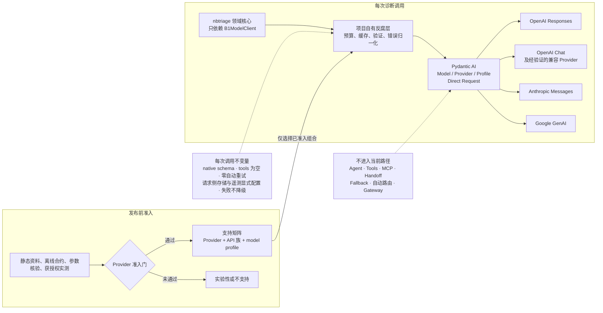
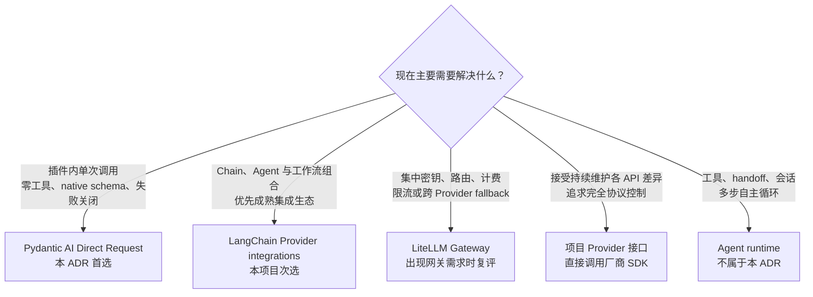

# ADR-0008：采用 Pydantic AI 的受控模型适配层

| 状态 | 提议日期 | 采纳日期 |
|---|---|---|
| 已采纳；语义 assessment 实现由 ADR-0044、Provider extra 所有权由 ADR-0047 部分替代 | 2026-08-09 | 2026-08-09 |

> [ADR-0044](0044-use-pydantic-ai-agent-output-type-for-support-semantics.md) 只对支持入口语义 assessment
> 改用 Pydantic AI `Agent(output_type=SupportSemanticAssessment)`；本 ADR 的 B1 Direct Request、
> Provider / Model / Profile 分层和零业务工具边界继续有效。

> [ADR-0047](0047-reuse-pydantic-ai-provider-extras.md) 已替代项目自造 `model-` extra 名称与重复固定底层
> SDK 的安装决定；这里保留的旧名称和版本是当时的实施历史，不再是当前公开安装接口。

## 背景

当前 B1 领域边界已经通过 `B1ModelClient` 把模型调用隔离在核心之外，但具体实现直接依赖 OpenAI Python
SDK，并分别维护 OpenAI Responses 与 DeepSeek Responses 客户端。这个实现证明了严格结构化输出、单次调用
预算、`tools=[]`、`store=False` 和本地缓存等边界，却不能自然扩展到 Anthropic Messages、Google GenAI
或其他经过验证的 API 族。

项目需要决定的是“如何适配不同模型 API”，而不是现在选择某个默认模型，也不是把诊断流程交给第三方
Agent 运行时。适配层必须继续服从以下不变量：

- 领域核心只依赖项目自己的协议和请求 / 响应类型；
- 每次诊断调用的次数、超时、token 上限与付费确认由项目控制；
- 不向模型暴露函数工具、内置工具、MCP、Shell 或外部写入能力；
- 结构化输出必须使用经确认的 Provider 原生 JSON Schema，能力不足时失败，不能静默退回工具调用、提示词
  JSON、字段丢弃或另一个模型；
- Provider SDK 的网络重试必须可关闭，数据保存和遥测必须显式配置；
- “兼容 OpenAI API”只是一条候选传输路径，不能自动等同于正式支持。

## 目标调用边界

下图表达本 ADR 已采纳的目标边界，不表示依赖或生产实现已经完成。Provider 准入发生在发布支持声明之前；
运行时只能从已经通过准入的组合中选择，而不是在每次请求时临时相信任意 endpoint。

## 调研范围与判据

本次比较 `pydantic-ai-slim`、LangChain Provider integrations、LiteLLM、Instructor、Any-LLM、
OpenAI Agents SDK，以及继续为每个 Provider 手写客户端。判据按项目风险排序：

1. 能否在没有 Agent 循环和工具调用的情况下完成一次原生结构化请求；
2. 能否显式区分 Provider、API 族、模型能力与请求语义，并在不支持时失败；
3. 能否让项目拥有重试、调用预算、验证、缓存、安全守门与支持矩阵；
4. Provider 依赖能否按需安装，而不是让 NoneBot 插件基础安装携带所有厂商 SDK；
5. 是否提供归一化消息、响应、用量和无真实模型测试替身；
6. Python 3.11 至 3.14 的包元数据与依赖能否解析。

为了避免只从库的自述推导结论，另取 AstrBot、Dify、Open WebUI、LobeChat、Flowise 和 Langflow 的固定
提交作为产品样本。样本覆盖 Python Bot、Agent 应用平台、自托管聊天网关、TypeScript 聊天产品和可视化工作
流产品；它们用于观察真实适配边界和维护代价，不用 GitHub 热度代替本项目的兼容性判据。

本次只读取公开文档、PyPI 元数据和固定提交的静态源码，并用 `uv pip compile` 做依赖解析；没有安装、导入
或运行候选库及样本产品，也没有调用真实模型。除既有 Pydantic AI 候选依赖外，
`langchain-core==1.4.8`、`langchain-openai==1.3.3`、`langchain-anthropic==1.4.6` 与
`langchain-google-genai==4.2.1` 的组合也在 Python 3.11、3.12、3.13、3.14 上通过静态解析。

## 调研结论

| 候选 | 与当前边界的匹配 | 结论 |
|---|---|---|
| `pydantic-ai-slim` | `Model` / `Provider` / `Profile` 分层；公开 Direct Request API 只做消息与输出 schema 转换；原生输出能力不足时失败；Provider 通过 extras 按需安装；提供 `TestModel`、`FunctionModel` 和全局真实请求禁用开关 | 首选，但只采用模型适配与直接请求层 |
| LangChain Provider integrations | Flowise、Langflow 已真实采用；Provider 包可独立安装；不用 Agent 也能直接调用，并可显式指定 `with_structured_output(method='json_schema')` | 有最强的样本产品采用证据，是次选；但结构化输出由各 Provider integration 分别实现，核心基类不提供统一实现，OpenAI / Anthropic 默认仍为 function calling，严格失败语义需要项目逐条包裹和验证 |
| LiteLLM | Provider 覆盖最广，能查询 `response_format` / JSON Schema 支持；同时包含路由、回退、费用与 Proxy 能力，基础依赖明显更重，并提供静默丢弃不支持参数的选项 | 若未来明确需要集中式 Gateway、路由或多租户费用治理再复评；首个插件内适配层不采用 |
| Instructor | 擅长把 Pydantic 验证和重试补到厂商客户端上；但 OpenAI Responses 的主路径使用 output tools，跨 Provider 模式还可能是工具调用或提示词 JSON | 与 `tools=[]`、单次调用预算和通用能力画像不匹配 |
| Any-LLM | 统一面较广，也覆盖 Responses；当前基础安装同时强依赖 OpenAI 与 Anthropic SDK，Provider 路径仍需逐个验证；OpenAI Agents SDK 将其集成标为 best-effort beta | 保留观察，不作为首选 |
| OpenAI Agents SDK 等 Agent 运行时 | 能编排模型、工具、handoff、guardrail 和会话；非 OpenAI 的 Any-LLM / LiteLLM 集成仍是 best-effort beta | 解决的问题大于模型适配，会与现有会话和安全控制面重叠 |
| 每个 Provider 手写 | 可以精确复刻当前边界，但需要自行维护各 API 的消息、schema、拒答、错误、用量、流式事件和版本差异 | 只保留项目反腐层和特殊参数映射，不重复实现完整厂商适配 |

### 热门产品的实际做法

| 产品样本 | 静态源码中的实现方式 | 对本项目的含义 |
|---|---|---|
| AstrBot | 自建 `AbstractProvider` / `Provider`，分别直接调用 OpenAI、Anthropic、Google SDK；公开文档把 OpenAI、Google GenAI、Anthropic 定义为三类原生 API，并允许服务通过其中一种兼容格式接入 | 最接近 NoneBot/Bot 场景，支持项目拥有 Provider 边界和按 API 族表达兼容；但它没有采用通用适配库，OpenAI Chat 与 Responses 两个适配文件合计已超过 2,100 行，还包含私有 SDK 导入、Provider 级恢复和多层重试，不适合复制到本项目的严格单次调用路径 |
| Dify | 从 1.0 起把模型移到独立插件；插件实现 Dify 的 `LargeLanguageModel` 接口，OpenAI、Anthropic、Gemini 官方插件再分别直接调用厂商 SDK | 证明“产品协议 + Provider 插件 + 官方 SDK”适合大型平台，也证明库宣称支持不能替代逐 Provider 生命周期；对单 wheel NoneBot 插件而言，完整插件运行时过重 |
| Open WebUI | 自建基于 `aiohttp` 的 OpenAI-compatible `/chat/completions` 与 `/responses` 代理，并维护 Anthropic 与 OpenAI 消息 / 响应转换；项目虽依赖官方 SDK 和 LangChain，但核心代理路径不是统一模型库 | 这是网关产品的协议归一化方案，适合代理任意上游 URL，却把协议转换、安全和兼容负担留在产品内；不应据此把本插件变成模型网关 |
| LobeChat | 自建 `ModelRuntime`、OpenAI-compatible / Anthropic-compatible factory 和 Provider 实现，运行时直接依赖 OpenAI、Anthropic、Google SDK | 再次支持按 API 家族建立 factory，而不是把所有“兼容”端点视为同一种能力；同时表明成熟聊天产品仍需大量产品侧归一化代码 |
| Flowise | Chat Model 节点主要建立在 LangChain JS 的 Provider packages 上；LiteLLM 节点把 LiteLLM 当作外部 OpenAI-compatible server，而不是产品内统一运行时 | 证明采用第三方模型适配层是成熟路线，也区分了“应用内 Provider adapter”和“外部 Gateway”两个职责 |
| Langflow | Provider 以扩展 bundle 发布，OpenAI / Anthropic 组件使用 `langchain-openai` / `langchain-anthropic`；Anthropic bundle 仍需修补私有 `_get_request_payload` 以处理 thinking 兼容 | 为 Python 采用 LangChain 提供最强产品证据，也显示通用库不能消除 Provider 特例和升级风险；项目仍需自己的窄接口与合约测试 |

产品样本没有给出一个“大家都采用”的库，而是形成两种主流模式：大型聊天 / Agent 平台自建上层 Provider
协议并直连官方 SDK，工作流产品更多复用 LangChain Provider integrations。两种模式共同保留了产品自己的领域接口、
Provider 配置和兼容测试；没有任何样本把“OpenAI-compatible”直接当成无条件支持承诺。

### 候选方案按职责定位

下图按候选方案主要解决的职责分流，不表示生态热度排名。选择会随产品问题改变；当前分支由已经冻结的
插件调用边界决定。

因此，本 ADR 的“首选”含义是**按本项目已冻结不变量计算后的最佳匹配**，不是生态采用率最高。若主要目标是
工作流组合和最大化成熟产品采用证据，LangChain 更占优；若主要目标是集中网关、路由和费用治理，LiteLLM 更
占优；若追求完全控制且接受持续维护，AstrBot / Dify 式直连 SDK 更占优。当前目标则是一个可选、轻量、
零工具、单次原生结构化调用的 NoneBot 插件能力，Pydantic AI Direct Request 对这些约束的公开表达最直接。

关键核验结果如下：

- `pydantic_ai.direct.model_request()` 是公开的薄封装，直接调用选定 `Model.request()`，不会启动 Agent
  图或输出验证重试循环；
- `ModelRequestParameters` 可以同时设置 `output_mode='native'`、`OutputObjectDefinition`，并让
  `function_tools`、`native_tools`、`output_tools` 全部为空；
- 2.27.0 的 `Model.prepare_request()` 会在 Profile 未声明 `supports_json_schema_output` 时抛错，
  不会从 native 静默降级；
- Pydantic AI 的 Agent 默认结构化输出是 Tool Output，因此项目不得使用默认 `Agent(output_type=...)`
  路径。即使以后需要 Agent 的其他能力，也必须另立 ADR；
- LangChain 允许脱离 Agent 直接调用 `ChatOpenAI`、`ChatAnthropic` 和 `ChatGoogleGenerativeAI`，也能显式
  选择 native `json_schema`；但 `BaseLanguageModel.with_structured_output()` 本身未实现，OpenAI 与
  Anthropic integration 的默认方法是 `function_calling`，不能依赖默认值满足零工具边界；
- `pydantic-ai-slim` 2.27.0 要求 Python `>=3.10`，基础依赖不强制安装任一厂商 SDK。包含 NoneBot、
  Alconna、Pydantic 与 `pydantic-ai-slim[openai,anthropic,google]` 的候选依赖在 Python 3.11、3.12、
  3.13、3.14 上均通过静态解析；这只能证明依赖可解，不能替代运行和 Provider 合约测试；
- Pydantic AI 2.0 已是稳定版本，但发布时间较近；版本策略允许 minor release 修复影响依赖未公开行为，
  因此实现必须锁版本并用合约测试保护公开表面。

## 决策

1. 采用 `pydantic-ai-slim` 作为 `nbtriage` 当前约束下最佳匹配的模型 API 适配库；这不是对市场
   采用率或所有 Agent 产品的通用结论；
2. 保留项目自己的领域协议作为反腐层。`nbtriage` 的诊断、评测和会话代码不能直接依赖 Pydantic AI 的
   Agent、消息或 Provider 类型；
3. 实现层只使用稳定公开的 `Model` / `Provider` / `Profile`、消息类型和
   `pydantic_ai.direct.model_request()`；不采用 Agent graph、toolset、MCP、handoff、fallback model、
   gateway 或自动路由；
4. 结构化诊断请求必须同时满足：
   - `output_mode='native'`；
   - `function_tools=[]`、`native_tools=[]`、`output_tools=[]`；
   - Profile 明确支持 JSON Schema；
   - 响应由项目自己的 Pydantic schema 再验证；
   - 验证失败直接形成一次失败结果，不自动发起第二次模型请求；
5. Provider factory 必须显式关闭厂商 SDK / HTTP 客户端重试，并显式关闭 Pydantic AI instrumentation。
   如果某条 Provider 路径不能证明调用次数或遥测边界，就不能进入正式支持矩阵；
6. OpenAI Responses 继续显式设置 `openai_store=False`。其他 Provider 的数据使用、地域、保留和训练
   策略属于各自的准入事实，统一适配库不能替代这些审查；
7. 允许不同 API 族，但按 `Provider + API 族 + model profile` 逐条准入，而不是允许任意 URL：
   - OpenAI Responses；
   - OpenAI Chat Completions 及经验证的兼容 Provider；
   - Anthropic Messages；
   - Google GenAI；
   - 其他 API 族在新增 Provider 前复用同一准入门，不因库宣称支持而自动开放；
8. 基础 NoneBot 插件安装不携带模型 Provider。模型能力通过独立 optional extras 按需安装；具体 extras
   命名和首批正式 Provider 留给实现切片决定。

## Provider 准入门

每个 `Provider + API 族 + model` 组合只有同时通过以下门槛，才能在文档中标记为“支持”：

1. **静态门**：Python 3.11、3.12、3.13、3.14 依赖可解，许可证和最低 SDK 版本可接受；
2. **离线合约门**：假 HTTP / `FunctionModel` 覆盖消息映射、空工具集合、native schema、拒答、截断、
   用量、超时、错误归一化和零自动重试；测试期间全局禁止真实模型请求；
3. **参数门**：不支持的参数必须失败，禁止 `drop_params` 一类静默丢弃；存储、遥测、base URL 和密钥来源
   均可核对；
4. **Provider 实测门**：在另行取得真实 API 调用与费用授权后，用最小合约集验证线上的请求形状和结构化
   输出；未经实测只能标记“实验性”；
5. **回归门**：固定 Provider / API / model 组合、适配库版本和归一化快照；升级后重新跑同一合约集；
6. **支持矩阵门**：分别记录“支持 / 实验性 / 不支持”及依据，OpenAI-compatible 不能作为一行笼统承诺。

## 后续关系

2026-08-09 的 ADR-0012 为 B4 有界 Agent 新增独立的 deferred tool 单步路径，并在该路径内取代本 ADR
“不采用 Agent/toolset”的排除项。本 ADR 对 B1 Direct Request 的零工具结构化输出决定保持不变；两条路径
继续共用领域反腐层、逐 Provider 准入、零重试、显式预算和失败关闭要求。

相关决定见
[ADR-0012：让 Pydantic AI Deferred Tools 位于领域 Agent runtime 之后](0012-use-pydantic-ai-deferred-tools-behind-domain-runtime.md)。

## 代价与限制

- 项目新增一层第三方抽象，Provider SDK 升级问题可能同时来自 Pydantic AI 与厂商 SDK；
- 本次产品样本没有发现以 Pydantic AI 作为核心适配层的同类热门 Bot 产品；选择依据是公开接口与安全边界
  的匹配度，而非既有产品采用背书，因此首批 Provider 合约验证比采用成熟度更重要；
- Pydantic AI 的默认 Agent 用法不满足本项目边界，代码审查必须持续防止误用默认 Tool Output；
- Profile 是准入提示而不是线上真相，仍然需要逐 Provider / model 的合约测试与支持矩阵；
- Direct Request 只归一化请求和响应，结构化 JSON 提取、语义验证、缓存键、安全守门和调用预算仍由项目
  自己负责；
- 本 ADR 不决定默认 Provider、默认模型、模型选择策略、fallback、路由、费用上限或插件聊天入口。

## 重新评估条件

出现以下任一情况时重新比较 LiteLLM、Any-LLM 或自建适配：

- 需要由独立 Gateway 统一处理多租户密钥、限流、费用、审计或跨 Provider fallback；
- 首批两个原生 API 族无法通过 Pydantic AI 的准入门；
- Direct Request 或 native output 公共表面在锁定版本内无法维持单次调用与零工具不变量；
- wheel / 冷启动成本对 NoneBot 插件部署造成经测量的不可接受影响。

## 落实与确认

- 2026-08-09：维护者在完成候选库、热门产品实现和 Python 3.11–3.14 兼容调研后明确采纳本 ADR；
- 实施情况：首个参考路径已落实。`model-openai` extra 固定 `pydantic-ai-slim[openai]==2.27.0` 与
  `openai==2.53.0`，基础 wheel 不携带模型 Provider；OpenAI CLI 已使用
  `src/nbtriage/openai_adapter.py` 的 Pydantic AI Responses factory，并通过假 HTTP、Python 3.11–3.14 与
  无 extra 隔离验证；
- 2026-08-09：第二原生 API 族选择 Anthropic Messages。`model-anthropic` 独立固定
  `pydantic-ai-slim[anthropic]==2.27.0` 与 `anthropic==0.121.0`，官方 Provider 的 native schema、拒答、
  截断、usage、错误归一化、零重试和单 extra wheel 隔离均由全离线合约验证；未获线上资格，支持矩阵仍
  标记实验性；
- 2026-08-09：为 DeepSeek Responses 增加语义独立的 `model-deepseek` extra 和
  `src/nbtriage/deepseek_adapter.py`。它固定官方 endpoint、显式 `DeepSeekProvider`、
  `deepseek-v4-flash`、非思考模式和零 SDK retry，并用假 HTTP 分别验证 B1 native JSON Schema 与 B4
  function tools。Pydantic AI 2.27.0 尚未声明 DeepSeek native schema profile，adapter 依据当前官方接口
  显式补足该能力；Provider wire 不发送 OpenAI `strict` 输出字段，tools 为 `strict=false`，参数继续由
  Pydantic 与领域层在本地复核。共享 `model_usage.py` 从响应保留 Provider / model / request identity 与
  可选指纹，并只在返回身份匹配请求时归一化费用；缺失或漂移会失败关闭。滚动模型别名尚未经过获授权
  线上资格门，因此仍为实验性；
- 2026-08-11：ADR-0016 收紧插件安装面后，DeepSeek 适配器迁入
  `tools/nbtriage_maintainer/deepseek_adapter.py`，公开 `model-deepseek` extra 删除，其依赖改由仓库
  `maintainer` dependency group 提供；Provider 身份、固定 endpoint 和本地复核语义不变；
- 2026-08-09：为一次真实模型测试增加 evaluation-only OpenCode Go B4 adapter。它复用开发依赖中的
  OpenAI SDK，但固定 Go Chat endpoint、独立审计身份、非思考模式和零 SDK retry；假 HTTP 已验证 deferred
  tool wire、返回身份 / fingerprint、cache hit/miss 费用和单请求失败。它没有公开 extra、CLI/backend、
  插件配置或支持资格，也不改变本 ADR 的 B1 native-schema 契约；获授权的 native JSON Schema 探测返回
  HTTP 400，只作为测试事实保留；
- 2026-08-14：为接入 `pydantic-ai-harness==0.20.0` 的共享只读工具，全部 Provider extras 与开发组
  统一升级并精确锁定到 `pydantic-ai-slim==2.28.0`。原有 Model / Provider / Profile 分层与领域资格表
  继续有效；升级后的结构化输出、工具调用和假 HTTP 适配回归需作为新的实现证据维护；
- 采纳只确认适配层和安全边界，不确认默认 Provider、默认模型或真实付费调用。

## 证据来源

- [Pydantic AI：Models and Providers](https://pydantic.dev/docs/ai/models/overview/)
- [Pydantic AI：Direct Model Requests](https://pydantic.dev/docs/ai/api/pydantic-ai/direct/)
- [Pydantic AI：Output modes](https://pydantic.dev/docs/ai/core-concepts/output/)
- [Pydantic AI：Testing](https://pydantic.dev/docs/ai/guides/testing/)
- [Pydantic AI：Version Policy](https://pydantic.dev/docs/ai/project/version-policy/)
- [Pydantic AI 2.27.0：ModelRequestParameters 静态源码](https://github.com/pydantic/pydantic-ai/blob/v2.27.0/pydantic_ai_slim/pydantic_ai/models/__init__.py)
- [DeepSeek Responses API](https://api-docs.deepseek.com/api/create-response)
- [DeepSeek Models & Pricing](https://api-docs.deepseek.com/quick_start/pricing)
- [LangChain：Chat model integrations](https://docs.langchain.com/oss/python/integrations/chat)
- [LangChain：OpenAI `with_structured_output`](https://reference.langchain.com/python/langchain-openai/chat_models/base/BaseChatOpenAI/with_structured_output)
- [LangChain：Anthropic `with_structured_output`](https://reference.langchain.com/python/langchain-anthropic/chat_models/ChatAnthropic/with_structured_output)
- [LangChain：Google GenAI structured output](https://docs.langchain.com/oss/python/integrations/chat/google_generative_ai#structured-output)
- [LiteLLM：Structured Outputs](https://docs.litellm.ai/docs/completion/json_mode)
- [LiteLLM：Drop Unsupported Params](https://docs.litellm.ai/docs/completion/drop_params)
- [Instructor：Mode Migration](https://python.useinstructor.com/concepts/mode-migration/)
- [OpenAI Agents SDK：Models and third-party adapters](https://openai.github.io/openai-agents-python/models/)
- [OpenAI 官方文档：Providers and transport](https://developers.openai.com/api/docs/guides/agents/models#providers-and-transport)
- [AstrBot：Provider 抽象](https://github.com/AstrBotDevs/AstrBot/blob/30e20318cbaaa2e1ba57f3e0eee265d9ee98115c/astrbot/core/provider/provider.py)
- [AstrBot：OpenAI Chat adapter](https://github.com/AstrBotDevs/AstrBot/blob/30e20318cbaaa2e1ba57f3e0eee265d9ee98115c/astrbot/core/provider/sources/openai_source.py)
- [AstrBot：OpenAI Responses adapter](https://github.com/AstrBotDevs/AstrBot/blob/30e20318cbaaa2e1ba57f3e0eee265d9ee98115c/astrbot/core/provider/sources/openai_responses_source.py)
- [AstrBot：LLM Provider 配置说明](https://docs.astrbot.app/en/providers/start.html)
- [Dify official plugins：模型插件说明](https://github.com/langgenius/dify-official-plugins/blob/0e4ec8c9f5477c4574dcc15200e14c8bf6bc2743/README.md)
- [Dify：OpenAI LLM plugin](https://github.com/langgenius/dify-official-plugins/blob/0e4ec8c9f5477c4574dcc15200e14c8bf6bc2743/models/openai/models/llm/llm.py)
- [Dify：Anthropic LLM plugin](https://github.com/langgenius/dify-official-plugins/blob/0e4ec8c9f5477c4574dcc15200e14c8bf6bc2743/models/anthropic/models/llm/llm.py)
- [Dify：Gemini LLM plugin](https://github.com/langgenius/dify-official-plugins/blob/0e4ec8c9f5477c4574dcc15200e14c8bf6bc2743/models/gemini/models/llm/llm.py)
- [Open WebUI：OpenAI-compatible router](https://github.com/open-webui/open-webui/blob/01f4282f1ffe0d6212f58d3afbeae21fffd0c4be/backend/open_webui/routers/openai.py)
- [Open WebUI：Anthropic protocol conversion](https://github.com/open-webui/open-webui/blob/01f4282f1ffe0d6212f58d3afbeae21fffd0c4be/backend/open_webui/utils/anthropic.py)
- [LobeChat：ModelRuntime](https://github.com/lobehub/lobe-chat/blob/d633b07a20f547b874db6eeed53c6dfa1ead2fe6/packages/model-runtime/src/core/ModelRuntime.ts)
- [LobeChat：model-runtime dependencies](https://github.com/lobehub/lobe-chat/blob/d633b07a20f547b874db6eeed53c6dfa1ead2fe6/packages/model-runtime/package.json)
- [Flowise：LangChain Provider dependencies](https://github.com/FlowiseAI/Flowise/blob/1939b5f3747eff2641f3b7332e9fff33d637fbee/packages/components/package.json)
- [Flowise：LiteLLM node](https://github.com/FlowiseAI/Flowise/blob/1939b5f3747eff2641f3b7332e9fff33d637fbee/packages/components/nodes/chatmodels/ChatLitellm/ChatLitellm.ts)
- [Langflow：OpenAI extension bundle](https://github.com/langflow-ai/langflow/blob/3325c4642c489bfc2e2f4c9f3c63a32961f9581f/src/bundles/openai/src/lfx_openai/components/openai/openai_chat_model.py)
- [Langflow：Anthropic compatibility wrapper](https://github.com/langflow-ai/langflow/blob/3325c4642c489bfc2e2f4c9f3c63a32961f9581f/src/bundles/anthropic/src/lfx_anthropic/anthropic_chat_model.py)

## 相关文档

- [架构概览](../architecture/overview.md)
- [ADR-0002：分级自治与责任层修复](0002-tiered-autonomy-and-ownership-aware-remediation.md)
- [模型 Provider 支持矩阵](../architecture/model-provider-support.md)
- [有界 Agent 单步与恢复流程](../architecture/flows/bounded-agent-step.md)
