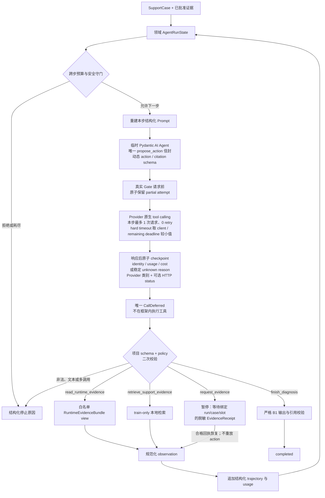

# 有界 Agent 单步与恢复流程

这张图描述 B4 离线 control plane 的稳定边界，不代表当前 NoneBot Matcher 已调用模型。模型只能提出本步
action；领域 runtime 始终拥有授权、执行、状态和停止权。

## 两层职责

| 层 | 拥有的职责 | 明确不拥有 |
|---|---|---|
| 领域 runtime | 状态、跨步预算、按 capability / trajectory 收缩 action 白名单、参数复核、observation 执行、暂停恢复、trajectory、停止 | Provider wire、SDK 类型 |
| Pydantic AI 单步适配器 | 把动态 action 联合和已观察 citation 渲染为唯一 `propose_action` schema、参数解析、协议响应、返回 Provider / model / request identity 与单步 usage / cost 归一化；以 client timeout 和领域剩余 deadline 较小值执行 hard timeout；DeepSeek Responses 未承诺 strict wire 时仍执行本地参数校验 | 会话循环、项目授权、工具副作用、持久状态 |
| 真实 Gate 审计层 | 独立 `b4-real-partial`、请求前/响应后原子 checkpoint、Provider failure reason / 可选 HTTP status、whole-run timeout、成功报告 no-overwrite 发布与失败 code/stage | 模型决策、产品 Provider 资格、对未知响应猜测 token 或费用、保存响应 body / headers / 异常文本 |

## 不变量

- 每一步只创建一个临时客户端并接受恰好一个 Provider 请求；会话是否继续由领域预算判断；
- 领域 runner 原已用剩余 deadline 包围整个 `choose_action`；单步 adapter 也用同一剩余值与 client timeout
  的较小值包住 `Agent.run()`，使 direct client 调用同样有硬墙钟上限。剩余 deadline 为 0 时在模型调用和
  call-slot 计数前抛出 `TimeoutError`；其他 hard timeout 也保留该异常，由 runner 映射为 `DEADLINE`；
- 唯一框架工具立即 deferred；信封联合只含本轮可用 capability，已产生 observation 的只读能力不再暴露，
  citation 只允许来自已观察支持案例；未知 action、多个调用、自由文本和不合法参数在读取任何 observation 前失败；
  Provider 支持 strict tool definition 时显式启用；DeepSeek Responses 当前 `strict=false`，不会跳过
  Pydantic 与领域层的本地二次校验；
- 持久状态不包含 Pydantic AI message history、原始日志、秘密、身份、Gold 或私有 Chain-of-Thought；
- 重复 action、连续无进展、token/cost/deadline/turn/tool 超限、取消和模型错误都有稳定停止原因；
- Provider 已返回但 action 在框架 / 本地后验校验失败时，adapter 通过 `capture_run_messages()` 取得最后一个
  `ModelResponse`，仍将该响应的 token、费用和身份写入 trial；若请求已保留却没有 Provider 响应或无法取得
  usage，则费用未知并停止真实 Gate；返回 Provider / model 身份缺失或与 backend / 请求不符不得晋级；
- 真实 Gate 的目标 report 与同名 `.partial.json` 必须都是新路径。每个 B1/B4 请求先写
  `reserved_response_unknown` 再出站；响应后写已计费记录，未取得可审计响应只写 `deadline`、`cancelled`、
  `provider_error` 或 `local_error`。`provider_error` 只接受 adapter 提交的结构化 failure reason，并在
  Pydantic AI 提供 `ModelHTTPError.status_code` 时保存 4xx/5xx 状态；response body、headers 与异常消息不落盘。
  普通 `B1ProviderError` / `AgentStepError` 记为 `local_error`。checkpoint 写失败时不发请求；
- 完整 Gate 另受 whole-run timeout 包围。协作式 timeout / 取消会在收尾路径把 partial 标记为 `aborted` 并
  保留稳定 code/stage；直接 `KeyboardInterrupt` 或进程强杀若未进入 `finally`，partial 可仍是 `running`，
  最后一个 `reserved_response_unknown` attempt 继续按响应未知处理。成功时先标记 `report_ready`，再以
  no-overwrite 方式发布正式报告，最后标记 `completed`；
- `request_evidence` 只暂停，不向真实用户发送消息；当前脚本 Gate 也不执行网络或外部工具。

实现见 `src/nbtriage/bounded_agent.py`、`src/nbtriage/pydantic_agent_adapter.py`、
`src/nbtriage/model_usage.py`、`tools/nbtriage_maintainer/deepseek_adapter.py` 与
`tools/nbtriage_maintainer/agent_evaluation.py`，选型依据见
[ADR-0012](../../adr/0012-use-pydantic-ai-deferred-tools-behind-domain-runtime.md)。
首轮线上失败边界与当前证据记录在本文和
[模型 Provider 支持矩阵](../model-provider-support.md)中。

第二次独立正式 DeepSeek run-2 在约 32.5 秒后以 `cost_unknown` 失败；legacy runner 没有写 success report 或
partial audit，也没有 retry / rerun。实际请求数、Provider acceptance、token、费用与失败阶段不可恢复，
墙钟时间只与 30 秒 deadline 一致而不证明因果。完整机器记录属于维护者本地报告；上述 partial audit 与
whole-run 机制是这次失败后的本地修正，不会反向补全 run-2。

第三次独立 DeepSeek run-3 在第 10 个 attempt 中止；partial 保留 9 个 Provider response、4 个 B1 与
4 个 B4 完成 trial、527 microUSD 已知费用与最后一个 `provider_error` response unknown，首次在线证明上述
checkpoint 能在失败后保全边界。它没有 success report；历史本地记录使用 schema v1，当前 v3 的 Provider
分类不能反向补造这次未知原因。

`tests/support/opencode_go_backend.py` 仅是 evaluation-only 兼容 Chat 测试夹具，用于验证 renderer、一次请求和
usage 失败关闭；它不进入上述运行流程，也不进入 wheel、CLI、插件配置或 Provider 资格。一次另行授权的
direct client smoke 只调用 1 次且没有 retry，本地未取得响应，外层约 388.7 秒后终止，Provider 是否受理、
usage 与费用均未知。该 smoke 绕过了原本已有 deadline 守门的领域 runner，因而暴露并促成上述 adapter 级
hard timeout；它不是产品或 Provider 结论。

hard timeout 修正后的第二次独立 test-only smoke 在 3465 ms 返回唯一 `request_evidence(logs)`：1 次 Provider
请求、660 / 78 input / output tokens、按测试价目归一化的 115 microUSD 等价值；Provider 身份与返回模型
匹配，request ID 存在、可选 fingerprint 缺失，自动 / 手工 retry 和项目工具执行均为 0。该结果只证明
窄 B4 tool wire 的一次线上样本可以完成，不覆盖第一次 388.7 秒结果未知的历史，也不证明产品 Provider、
网关选择、资格晋级或多 trial 质量。完整机器记录只在维护者本地保留。

2026-08-10 的 test-only 诊断进一步发现，并列四个 action tool 会诱发真实模型多调用；当前实现改为唯一
`propose_action` 信封，并按 capability、trajectory、citation 动态收窄。最终 typed action control 在原
4000-token 预算内用两次请求完成 runtime observation → finish。它只有一个成功 loop sample，不进入产品
支持或晋级；完整机器记录只在维护者本地保留。
