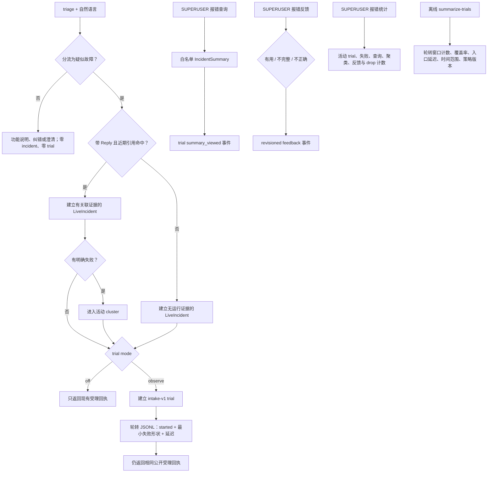

# 观察型生产 trial

## 首版闭环



trial 不是后台错误抓取器，也不是一般问答统计。只有 `triage` 请求被分流为 `suspected_incident` 后才进入
闭环；能力说明、用法纠错和澄清不进入。Reply 只决定能否补充运行证据。

## 任务与成功标准

当前 `intake-v1` 只回答一个问题：故障分支能否在不泄露原始对话和日志的前提下，持续形成维护者可查看、
可反馈、可聚合的真实 incident 样本。当前成功信号是：

- incident 已受理且取得不透明 trial ID；
- 维护者查看过白名单摘要；
- 维护者给出 `useful / incomplete / incorrect` 枚举反馈；
- trial 日志事件有稳定顺序，审计 drop 可见；
- 明确失败可关联活动 cluster，但 cluster 只表示最小失败形状相同，不等于根因或用户人数。

没有人工反馈的 trial 只提供运营分母，不算“诊断正确”。当前不会用点击、重复报障或模型自评替代质量标签。

## 日志 schema 与隐私边界

`started` 事件包含 schema / event / trial / incident ID、时间、mode、策略版本、sequence、可选 cluster、
运行状态、确定性 disposition、观察与失败计数、缓冲丢弃数、入口延迟，以及最多 16 个最小失败形状。
失败形状只由 lifecycle kind、adapter/event/plugin/Matcher/API 标识、异常类型和有限 stack module 组成。

`summary_viewed` 与 `feedback_recorded` 只追加查询次数或枚举反馈 revision。所有事件都禁止：

- 消息正文、命令原文和模型原始输出；
- 用户、群、频道、Bot 和平台消息 ID；
- correlation ID、API 参数 / 返回值、异常消息与 traceback 文本；
- API Key、Token、Cookie、配置值、私有 Chain-of-Thought。

JSONL 只支持单 Bot 进程内线程并发，按字节上限轮转并保留固定份数。多 worker 部署不得共享该文件；应将
结构化事件交给宿主的集中日志系统，或为每个进程配置独立路径。日志写失败只增加 drop counter，不改变
报障受理结果。

`just maintainer summarize-trials` 严格校验固定字段、schema、策略版本、事件语义与单行上限，按 event ID 去除轮转
重复，并只输出聚合计数。冲突重复、截断、超长或未知版本行计为 corrupt；汇总不会返回任何事件标识、失败
形状或原始日志。轮转文件只代表有界窗口，覆盖率不是模型准确率。

## 配置与命令

```dotenv
NBTRIAGE_TRIAL_MODE=observe
NBTRIAGE_TRIAL_LOG_PATH=logs/nbtriage-trials.jsonl
NBTRIAGE_TRIAL_LOG_MAX_BYTES=10485760
NBTRIAGE_TRIAL_LOG_BACKUP_COUNT=5
```

- 普通用户：`triage <求助内容>`，`@Bot` 可选；只有故障分支进入 trial；
- 维护者查询：`@Bot 报错查询 <incident_id>`；
- 维护者反馈：`@Bot 报错反馈 <incident_id> <有用|不完整|不正确>`；
- 维护者统计：`@Bot 报错统计`。

后三个入口在读取或修改 trial 状态前都要求 `SUPERUSER`。`trial_mode=off` 是默认值，不创建日志文件；启用
`observe` 也不会启用模型、Provider 密钥、工具或外部写操作。

## 上线前提与 smoke

- 单个 Bot 进程独占一个日志路径；多 worker 必须分别配置路径或接入宿主集中日志；
- 日志目录对 Bot 运行账号可写、对无关本机账号不可读，并由宿主仓库忽略；
- `NBTRIAGE_MODEL_ENABLED=false` 保持不变，observe 不需要 Provider API Key；
- 磁盘至少容纳 `max_bytes × (backup_count + 1)`，默认有界窗口约 60 MiB；
- 日志不得上传、提交、公开或用于训练，除非另行完成来源、隐私和许可证复核。

上线 smoke 依次验证：`triage 某个功能怎么使用` 得到说明且不产生 incident；`triage 刚才执行后报错了`
得到受理编号；再回复近期 Bot 消息验证证据关联。`SUPERUSER` 查询对应 incident、记录
一次枚举反馈并查看统计；非 `SUPERUSER` 无法读取后三个入口；日志只出现当前 JSONL 与有界编号备份，且
不含消息正文、平台身份、correlation ID、异常消息或 Provider 凭据。

## 离线汇总与故障处理

```powershell
just maintainer summarize-trials `
  --log-path logs/nbtriage-trials.jsonl `
  --backup-count 5
```

汇总器同时读取当前文件和编号备份，按 event ID 去重，只输出窗口计数、覆盖率、入口延迟、时间范围、mode
与策略版本。损坏、截断、超长、冲突重复或未知版本行计入 `corrupt_line_count`；相同轮转重复行计入
`duplicate_event_count`。单次汇总最多接受 1 GiB 和 250,000 个不同 event，超过上限失败关闭。

把 `NBTRIAGE_TRIAL_MODE` 改回 `off` 并按宿主流程重启，即停止新 trial 和日志写入；triage 故障分流、incident
查询、限流与引用关联仍继续工作。日志写入失败时公开报障保持可用并增加 drop；corrupt 增长时检查多进程
共用路径、外部截断和版本不一致；发生隐私或权限事故时立即切回 `off`、隔离日志并停止共享。不要直接编辑
现有 JSONL，调查应在副本上进行。

## 后续晋级顺序

1. **Observe**：先收集真实 incident、查询率、枚举反馈、cluster 分布、入口延迟和日志 drop rate；
2. **Shadow**：另立 schema，在相同 incident 上运行已通过 Gate 的候选诊断，但只供维护者对照，不改变普通
   用户响应；
3. **Canary**：只有 shadow 的安全、质量、成本、延迟与日志健康达到预冻结门槛后再决策，并保留总停机开关；
4. **扩大能力**：工具、长期记忆、多 Agent 或自动动作必须分别证明必要性并经过独立权限与评测决定。

首批运营晋级不按日历自动发生。建议至少积累 20 个显式 incident、10 个维护者反馈和 3 个不同活动 cluster，
同时保持零隐私 / 权限事故与低于 1% 的审计事件 drop rate，再评审是否值得开启模型 shadow；样本不足时继续
observe，不用模型填补证据缺口。

## 代码映射

| 边界 | 实现 |
|---|---|
| trial 状态、事件 schema、聚合与 JSONL 轮转 | `src/nbtriage/live_trials.py` |
| 脱敏轮转窗口汇总维护命令 | `src/nbtriage/live_trials.py`、`tools/nbtriage_maintainer/cli.py` |
| trial 配置、sink 装配与白名单格式化 | `src/nonebot_plugin_triage/config.py`、`src/nonebot_plugin_triage/trials.py` |
| incident 建立后的 fail-open trial 观察 | `src/nonebot_plugin_triage/live_reports.py` |
| SUPERUSER 查询、反馈与统计 Matcher | `src/nonebot_plugin_triage/handlers.py` |
| 隐私、轮转、TTL、容量与入口集成测试 | `tests/test_live_trials.py`、`tests/test_trial_runtime.py`、`tests/test_live_reports.py` |

## 相关决定

- [ADR-0014：先用观察型生产 trial 建立可评测闭环](../../adr/0014-use-observation-first-production-trials.md)
- [ADR-0006：跨平台 Alconna 入口与引用 Provider](../../adr/0006-cross-platform-alconna-entry-and-reference-providers.md)
- [ADR-0020：triage 自然语言入口与可选 Reply](../../adr/0020-use-triage-command-for-natural-language-support.md)
- [ADR-0010：用有界证据获取循环验证 Agent 能力](../../adr/0010-use-bounded-evidence-seeking-agent-loop.md)
