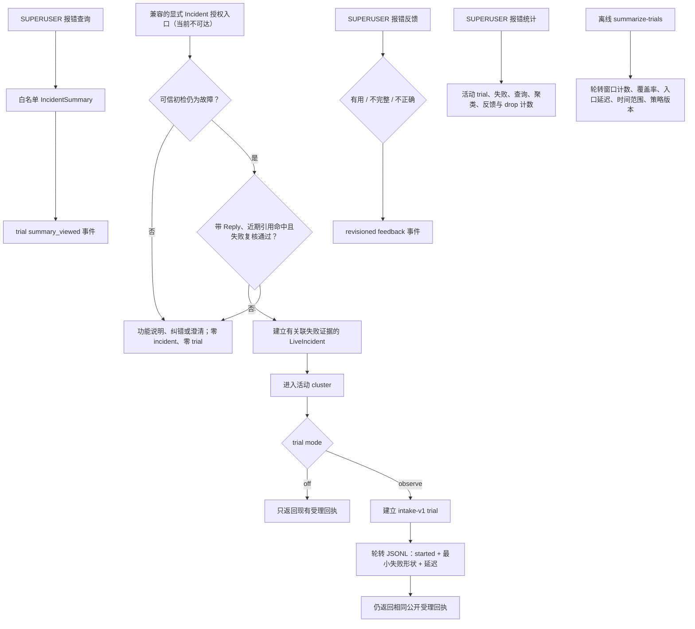

# 观察型生产 trial

> **当前状态：兼容闭环，在线入口不可达。** `support-semantic-v7` 已删除 `incident_intake`，当前 router / handler
> 不签发 `OPEN_INCIDENT`，因此下面的 LiveIncident / trial 流程不会由现行 `triage` 用户链触发。本文保留旧服务
> 的存储、运维和安全合同，只有未来通过新 ADR 重新接入显式授权入口后才能作为上线流程使用。

## 首版闭环



trial 不是后台错误抓取器，也不是一般问答统计。历史设计只有在显式请求先被兼容授权层分流为
`suspected_incident` 后才进入闭环；能力说明、用法纠错和澄清不进入。当前 v7 不产生该分流，所以普通
`triage` 不会创建 incident 或 trial；Reply 也不会自行获得建单权限。

## 任务与成功标准

兼容的 `intake-v1` 原本只回答一个问题：故障分支能否在不泄露原始对话和日志的前提下，持续形成维护者
可查看、可反馈、可聚合的真实 incident 样本。重新接入前，下列项目只是该旧闭环的验收合同，不是当前
线上可积累的指标：

- incident 已受理且取得不透明 trial ID；
- 维护者查看过白名单摘要；
- 维护者给出 `useful / incomplete / incorrect` 枚举反馈；
- trial 日志事件有稳定顺序，审计 drop 可见；
- 明确失败可关联活动 cluster，但 cluster 只表示最小失败形状相同，不等于根因或用户人数。

没有人工反馈的 trial 只提供运营分母，不算“诊断正确”。当前不会用点击、重复报障或模型自评替代质量标签。

## 日志 schema 与隐私边界

`started` 事件包含 schema / event / trial / incident ID、时间、mode、策略版本、sequence、可选 cluster、
运行状态、确定性 disposition、观察与失败计数、缓冲丢弃数、入口延迟，以及最多 16 个最小失败形状。
失败形状只由 lifecycle kind、adapter/event/plugin/Matcher/API 标识、异常类型和有限 stack module 组成。

`summary_viewed` 与 `feedback_recorded` 只追加查询次数或枚举反馈 revision。所有事件都禁止：

- 消息正文、命令原文和模型原始输出；
- 用户、群、频道、Bot 和平台消息 ID；
- correlation ID、API 参数 / 返回值、异常消息与 traceback 文本；
- API Key、Token、Cookie、配置值、私有 Chain-of-Thought。

JSONL 只支持单 Bot 进程内线程并发，按字节上限轮转并保留固定份数。`observe` 使用当前 triage 插件的
LocalStore data dir 下固定 `trial-events.jsonl`；多 worker 部署不得共享同一个 data dir，应让每个进程
解析到各自独占的 LocalStore data dir，或将结构化事件交给宿主的集中日志系统。日志写失败只增加 drop
counter，不改变报障受理结果。

`just maintainer summarize-trials` 严格校验固定字段、schema、策略版本、事件语义与单行上限，按 event ID 去除轮转
重复，并只输出聚合计数。冲突重复、截断、超长或未知版本行计为 corrupt；汇总不会返回任何事件标识、失败
形状或原始日志。轮转文件只代表有界窗口，覆盖率不是模型准确率。

## 配置与命令

```dotenv
NBTRIAGE_TRIAL_MODE=observe
NBTRIAGE_TRIAL_LOG_MAX_BYTES=10485760
NBTRIAGE_TRIAL_LOG_BACKUP_COUNT=5

# 可选：JSON 对象，按插件 ID 覆盖 LocalStore data dir
LOCALSTORE_PLUGIN_DATA_DIR={"nonebot_plugin_triage":"/var/lib/nonebot/triage-worker-1"}
```

- 普通用户当前不能通过 `triage` 创建 trial；未来若重新接入，仍必须使用显式授权入口；
- 维护者查询：`@Bot 报错查询 <incident_id>`；
- 维护者反馈：`@Bot 报错反馈 <incident_id> <有用|不完整|不正确>`；
- 维护者统计：`@Bot 报错统计`。

后三个入口在读取或修改 trial 状态前都要求 `SUPERUSER`。`trial_mode=off` 是默认值，不创建日志文件；启用
`observe` 也不会启用模型、Provider 密钥、工具或外部写操作。

## 上线前提与 smoke

- 单个 Bot 进程独占一个 LocalStore data dir；多 worker 必须分别覆盖
  `LOCALSTORE_PLUGIN_DATA_DIR` 中的 `nonebot_plugin_triage` 路径，或接入宿主集中日志；
- 日志目录对 Bot 运行账号可写、对无关本机账号不可读，并由宿主仓库忽略；
- observation trial 不要求配置模型 transport 或 Provider API Key；
- 磁盘至少容纳 `max_bytes × (backup_count + 1)`，默认有界窗口约 60 MiB；
- 日志不得上传、提交、公开或用于训练，除非另行完成来源、隐私和许可证复核。

当前中文 `support-semantic-v7-prompt-v5-zh` 已通过自己的 40 条独立 forward-heldout，可以按该精确组合进入
受控模型 observation trial。Guidance Answer Agent、教学注释和 Bug Agent
的中文 Prompt 同样仍是实验性，不能写成稳定能力。v7 也不再产生 incident action；旧 incident 查询、
反馈与统计仍是兼容维护面。日志只出现当前 JSONL 与有界编号备份，且不含消息正文、平台身份、correlation
ID、异常消息或 Provider 凭据。

## 离线汇总与故障处理

```powershell
just maintainer summarize-trials `
  --log-path <实际 triage 插件 data dir>/trial-events.jsonl `
  --backup-count 5
```

汇总器同时读取当前文件和编号备份，按 event ID 去重，只输出窗口计数、覆盖率、入口延迟、时间范围、mode
与策略版本。损坏、截断、超长、冲突重复或未知版本行计入 `corrupt_line_count`；相同轮转重复行计入
`duplicate_event_count`。单次汇总最多接受 1 GiB 和 250,000 个不同 event，超过上限失败关闭。

`summarize-trials` 仍要求部署者显式传入 `--log-path`，不会自行读取 Bot 的 LocalStore 配置或猜测目录。默认
布局下，插件 data dir 是 `nb localstore data` 显示的 base data dir 下的 `nonebot_plugin_triage/`；若配置了
`LOCALSTORE_PLUGIN_DATA_DIR` 的插件级覆盖，则实际目录就是该配置值，不再额外追加插件 ID。
旧 `NBTRIAGE_TRIAL_LOG_PATH` 不再生效；插件会在配置解析时明确拒绝该键并提示上述迁移入口，而不是静默
改写到另一个文件。
迁移前产生的 `logs/nbtriage-trials.jsonl` 不会自动搬运、合并或纳入新文件；如需分析，维护者必须显式把
旧文件作为独立输入，并自行完成隐私与来源复核。

把 `NBTRIAGE_TRIAL_MODE` 改回 `off` 并按宿主流程重启，即停止兼容 trial 和日志写入；维护者对既有 incident
的查询、入口限流与运行引用关联仍可独立工作，但当前 `triage` 本来就不会新增 incident。日志写入失败时兼容
服务保持原回执并增加 drop；corrupt 增长时检查多进程共用路径、外部截断和版本不一致；发生隐私或权限事故
时立即切回 `off`、隔离日志并停止共享。不要直接编辑现有 JSONL，调查应在副本上进行。

## 后续晋级顺序

以下晋级顺序只有在未来新 ADR 重新接通 incident 授权入口后才适用：

1. **Observe**：先收集真实 incident、查询率、枚举反馈、cluster 分布、入口延迟和日志 drop rate；
2. **Shadow**：另立 schema，在相同 incident 上运行已通过 Gate 的候选诊断，但只供维护者对照，不改变普通
   用户响应；
3. **Canary**：只有 shadow 的安全、质量、成本、延迟与日志健康达到预冻结门槛后再决策，并保留总停机开关；
4. **扩大能力**：工具、长期记忆、多 Agent 或自动动作必须分别证明必要性并经过独立权限与评测决定。

重新接入后的首批运营晋级不按日历自动发生。建议至少积累 20 个显式 incident、10 个维护者反馈和 3 个不同活动 cluster，
同时保持零隐私 / 权限事故与低于 1% 的审计事件 drop rate，再评审是否值得开启模型 shadow；样本不足时继续
observe，不用模型填补证据缺口。

## 代码映射

| 边界 | 实现 |
|---|---|
| trial 状态、事件 schema、聚合与 JSONL 轮转 | `src/nbtriage/live_trials.py` |
| 脱敏轮转窗口汇总维护命令 | `src/nbtriage/live_trials.py`、`tools/nbtriage_maintainer/cli.py` |
| trial 配置、sink 装配与白名单格式化 | `src/nonebot_plugin_triage/config.py`、`src/nonebot_plugin_triage/trials.py` |
| incident 建立后的 fail-open trial 观察 | `src/nonebot_plugin_triage/live_reports.py` |
| SUPERUSER 查询、反馈与统计 Matcher | `src/nonebot_plugin_triage/handlers.py` |
| 隐私、轮转、TTL、容量与入口集成测试 | `tests/test_live_trials.py`、`tests/test_trial_runtime.py`、`tests/test_live_reports.py` |

## 相关决定

- [ADR-0014：先用观察型生产 trial 建立可评测闭环](../../adr/0014-use-observation-first-production-trials.md)
- [ADR-0006：跨平台 Alconna 入口与引用 Provider](../../adr/0006-cross-platform-alconna-entry-and-reference-providers.md)
- [ADR-0020：triage 自然语言入口与可选 Reply](../../adr/0020-use-triage-command-for-natural-language-support.md)
- [ADR-0010：用有界证据获取循环验证 Agent 能力](../../adr/0010-use-bounded-evidence-seeking-agent-loop.md)
